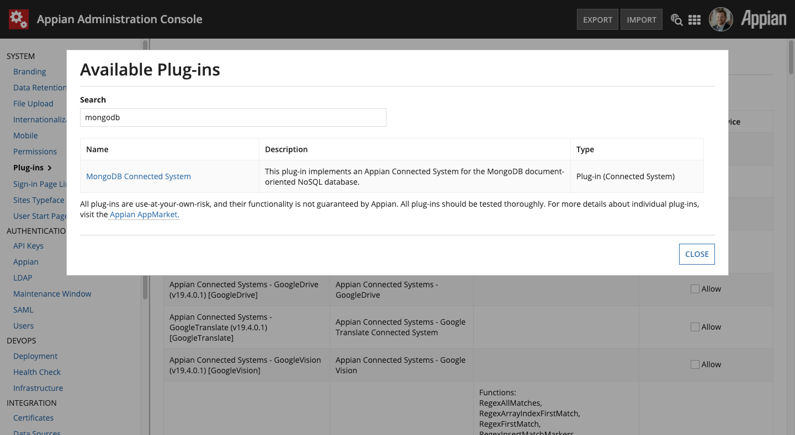
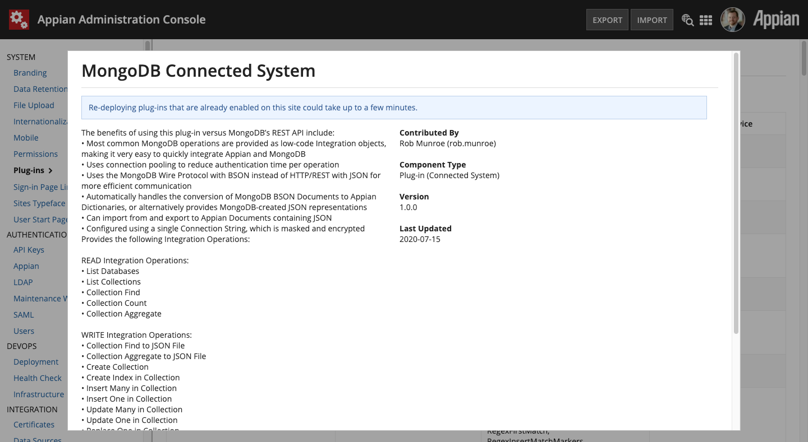

# Introduction

This plugin implements an Appian [Connected System](https://docs.appian.com/suite/help/latest/Connected_System.html) for [MongoDB](https://www.mongodb.com) using the [MongoDB Java Driver](https://mongodb.github.io/mongo-java-driver/3.12/) in synchronous mode.

Its official distribution location is this entry in the [Appian Community App Market](https://community.appian.com/b/appmarket/posts/mongodb-connected-system).


## Project Info

This plugin was created by me, [Rob Munroe](https://www.linkedin.com/in/robertmunroe/), Area Vice President, Solutions Consulting at [Appian](https://appian.com). I have been in software development since the late 90s, have been at Appian for over a decade now, and before joining was an Appian customer.

I have also been a fan of MongoDB since it first arrived in the late-00s. I feel that the speed and power of both Appian and MongoDB are a potent combination, and that both platforms pair very well given the strong support for JSON and dynamic data structures. Many customers have already integrated the two platforms using the standard [HTTP/REST Connected System](https://docs.appian.com/suite/help/latest/Integration_Object.html), however I wanted to make it even easier to use MongoDB inside of Appian as well as take advantage of what the MongoDB Java Driver had to offer.

The benefits of using this plugin versus MongoDB’s REST API include:

-  Most common MongoDB operations are provided as low-code [Integration objects](https://docs.appian.com/suite/help/latest/Integration_Object.html), making it very easy to quickly integrate Appian and MongoDB

-  Uses connection pooling to reduce authentication time per operation

-  Uses the [MongoDB Wire Protocol](https://docs.mongodb.com/manual/reference/mongodb-wire-protocol/) with [BSON](http://bsonspec.org) instead of HTTP/REST with JSON for more efficient communication

-  Automatically handles the conversion of MongoDB BSON Documents to Appian Dictionaries, or alternatively provides MongoDB-created JSON representations

-  Can import from and export to Appian Documents containing JSON

-  Configured using a single [Connection String](https://docs.mongodb.com/manual/reference/connection-string/), which is masked and encrypted

This project and [its source](https://github.com/rmunroe/appian-mongoDbConnectedSystem) are open to all, however it is best that any enhancements or bug fixes are submitted to me, so that I may update the released version on the [Appian App Market](https://community.appian.com/b/appmarket/posts/mongodb-connected-system) page. This will significantly speed up the process of getting your enhancements onto your Appian Cloud instance. Self-managed customers can build and deploy the code themselves, but I hope you will contribute your fixes and enhancements for the greater good.

If you are interested in contributing to this project, contact me via my Appian email address [munroe at appian dot com] or via [LinkedIn](https://www.linkedin.com/in/robertmunroe/).


## Audience

Users of this Connected System plugin are expected to be familiar with the [core concepts of MongoDB](https://docs.mongodb.com/manual/introduction/), including topics such as querying and aggregation syntax. Additionally, it is expected that you are familiar with your own Databases, Collections, Document schemas, and MongoDB server infrastructure.

Users are also expected to be familiar with Appian, building Applications, and how and why [Connected Systems](https://docs.appian.com/suite/help/latest/Connected_System.html) and [Integration Objects](https://docs.appian.com/suite/help/latest/Integration_Object.html) are used.


## Compatibility

This plugin was built and tested on Appian version 22.2.

Version 1.2 of this plugin uses the [MongoDB Java Driver version 3.12.10](https://mongodb.github.io/mongo-java-driver/3.12/) and should be compatible with any version of MongoDB from version 2.6 to 4.2 (the latest as of this writing). See this [compatibility chart](https://mongodb.github.io/mongo-java-driver/3.12/upgrading/#compatibility) for full details.

This plugin was tested against a [MongoDB Atlas](https://www.mongodb.com/cloud/atlas) a 3-node Replica Set instance running version 4.2.8 as well as a Standalone MongoDB 4.2.8 Community instance running on Ubuntu 22.04.

It is expected that your MongoDB instance(s) allow network connections from your Appian instance(s).

## Installation

If installing to a fully-managed Appian Cloud instance, install using the [Plugins](https://docs.appian.com/suite/help/latest/Appian_Administration_Console.html#plug-ins) panel of the [Administration Console](https://docs.appian.com/suite/help/latest/Appian_Administration_Console.html).





If installing to a self-managed Appian instance, copy the `ps-plugin-MongoDbConnectedSystem-X.X.jar` file to the `<APPIAN_HOME>/_admin/plugins` directory.


## Plugin Design Principles

This plugin was designed to mirror the functionality provided by MongoDB’s Java Driver. We have implemented the most common functionality as individual Integration Operations and are striving for 100% feature completeness over time. Please let [me](Project Info) know if there are missing features that you require.

Many of the operations of the MongoDB Java Driver take as arguments MongoDB BSON Documents. As such, Integration Operations that require BSON Documents will instead accept JSON strings, which the plugin handles converting to BSON. We have included a full suite of [JSON Query Expression Functions](#_JSON_Query_Expression_1) to cleanly and easily generate MongoDB JSON-based queries.


## Special Considerations

Due to how the MongoDB Java Driver returns Object IDs and Binary data types, special handling must be performed by the Connected System as described below.

> ### Important
> It is critical that you understand these special cases and design for them accordingly


### Dates and Times

Dates and times in MongoDB are different from most other databases in that it stores them in UTC by default and will convert any local time representations into this form. Applications that must operate or report on some unmodified local time value must store the time zone offset alongside the UTC timestamp (e.g. as a separate field) and compute the original local time in their application logic.

.. important:: It is up to you and your Application to account for this.

When storing Date and Time values from Appian to MongoDB, MongoDB will convert them to UTC. Therefore, any of your date queries should be against UTC dates and times. Use Appian’s built-in Date and Time [functions](https://docs.appian.com/suite/help/latest/Appian_Functions.html) to ensure the dates being sent to MongoDB make sense in this regard.

Also note that unlike Appian, there is no date *without time* data type in MongoDB. When wishing to store a date without time, use midnight UTC of that date (e.g. [2020-07-01T00:00:00.000Z`) and query accordingly. The `JSON Query Expression Functions](#_JSON_Query_Expression_1) will take this into account and convert Appian Dates to this format.


### Object IDs

While the [MongoDB Object ID](https://docs.mongodb.com/manual/reference/method/ObjectId/) data type is most often represented as a string (e.g.  "5efa0b06fc13ae730e00024a"), it is stored internally as 12-byte values broken down into several data points. It is far easier to work with the string value in Appian, so this Connected System will return a sub-Dictionary of the below form for each Object ID in the resulting dataset.

.. note:: This transformation only applies to results returned as Appian Dictionaries. JSON results use the MongoDB JSON notation.

A MongoDB Document representing this value:

```JSON
{
    _id: ObjectId("5efa0b06fc13ae730e00024a")
    ...
}
```

Would be returned as an Appian Dictionary like this:

```REXX
{
    _id: {
        oid: "5efa0b06fc13ae730e00024a"
    }
    ...
}
```

The key detail here is that Object ID fields will be accessed like this
in Appian

```REXX
local!theObjectId: local!myDocument._id.oid
```


#### Object ID CDT

This plugin contains a CDT named `{urn:com:appian:types:MongoDB}ObjectId` that can be used to represent these values in a consistent manner.  MongoDB Document properties in Dictionaries can be cast directly to this CDT.

It is highly recommended that you use this CDT when creating your own CDTs that represent the MongoDB Documents used in your application.  Using it also helps convert Appian Dictionaries representing MongoDB Documents to Mongo-friendly JSON using the `mdb_tojson` function, and the `mdb_tojson` function will return this value as well.

See the `{urn:com:appian:types:MCSD}MCSD_Customer` CDT in the demo application for example.


### Binary

MongoDB’s Binary data type allows you to store chunks of binary data in a MongoDB Document, however Appian does not support storing binary data in Dictionaries. To work around this any binary results will be returned as Base64 encoded text.

.. note:: This transformation only applies to results returned as Appian Dictionaries. JSON results use the MongoDB JSON notation.

.. warning:: Returning large amounts of Base64 encoded binary data to Appian can have severe impacts on the performance of the Appian environment. A best practice would be to use a projection and eliminate the binary field from the MongoDB Document.

A MongoDB Document representing this value:

```REXX
{
    binaryField: Binary("... Binary data value ...", 0)
    ...
}
```

Would be returned as an Appian Dictionary like this:

```REXX
{
    binaryField: {
        binary: "...Base64 encoded data...",
        type: "0"
    }
    ...
}
```

#### Binary CDT

Similarly to Object ID, this plugin contains a CDT named `{urn:com:appian:types:MongoDB}Binary` that can be used to represent these values in a consistent manner. MongoDB Document properties in Dictionaries can be cast directly to this CDT.

It is highly recommended that you use this CDT when creating your own CDTs that represent the MongoDB Documents used in your application.  Using it also helps convert Appian Dictionaries representing MongoDB Documents to Mongo-friendly JSON using the `mdb_tojson` function, and the `mdb_tojson` function will return this value as well.

See the `{urn:com:appian:types:MCSD}MCSD_Customer` CDT in the demo application for example.


# Connected System


This plugin provides a single Connected System Template for connecting to MongoDB named **MongoDB Connected System**. Configuration of the Connected System is very simple and only requires the [MongoDB Connection String](https://docs.mongodb.com/manual/reference/connection-string/).

> **Note**
> It is up to you to fully understand the MongoDB Connection String format, as many parameters can be set that affect the functionality of the [MongoDB Java Driver](https://mongodb.github.io/mongo-java-driver/3.12/) used by this plugin. 

A good rule of thumb is if you can connect to and work with your MongoDB Database using your Connection String in the [MongoDB Compass](https://www.mongodb.com/products/compass) application, you should have no issue using that Connection String with this Connected System.

The first step in using this plugin is to ensure it has been installed in your Appian environment. Please refer to the [Appian Documentation for installing plugins](https://docs.appian.com/suite/help/20.2/Appian_Administration_Console.html#plug-ins).

To add a new MongoDB Connected System in your Application, open the application in Designer, and click **New > Connected System**.

Select the **MongoDB Connected System**


Give it a **Name** and **Description**, and then paste your MongoDB **Connection String** in the provided text box and click **Test Connection**. Assuming you see "*Connection successful*" then simply click the **Create** button to finish.


# Integrations

Creating an Integration will be the same steps for all Integration operations listed below. Start by clicking **New > Integration** in your application in Designer.

Enter the name of your MongoDB **Connected System** object, select the Integration **Operation**, then give it a **Name** and **Description** and the folder to **Save In** and click **Create**.

.. figure:: media/image7.png


Each Integration Operation will be configured differently, as noted below.

.. note:: Unless noted otherwise, all parameters in all Integration Operations are expressionable, meaning that they can be mapped to rule inputs or otherwise derived at runtime.


***************************
READ Integration Operations
***************************

This section details all Integration Operations supported by the Connected System in a **READ** context. They can be used anywhere that Expressions are evaluated.


.. _READ List Databases:

List Databases
==============

This Integration executes the [List Databases](https://docs.mongodb.com/manual/reference/command/listDatabases/) operation to list all Databases available in the Connected System instance.

.. figure:: media/image8.png


The `result.databases.name` property is the MongoDB Database name that can be used as any Integration Operation's :ref:`Common Database` parameter value.


Parameters
----------


*Output Type*
^^^^^^^^^^^^^

Refer to :ref:`Common Output Type` in Common Configuration Parameters.


Result Value
------------

+------------------+----------------------+---------------------------------------------------------------------------------------------------------------------------------------+
| **Field Name**   | **Data Type**        | **Description**                                                                                                                       |
+------------------+----------------------+---------------------------------------------------------------------------------------------------------------------------------------+
| [databases`    | *List of Dictionary* | Dictionaries represent the `List Databases output data](https://docs.mongodb.com/manual/reference/command/listDatabases/#output)    |
+------------------+----------------------+---------------------------------------------------------------------------------------------------------------------------------------+


.. _READ List Collections:

List Collections
================

This Integration executes the [List Collections](https://docs.mongodb.com/manual/reference/command/listCollections/) operation to list all MongoDB Collections in the given Database available to the connected user.

.. figure:: media/image9.png


Parameters
----------


*Output Type*
^^^^^^^^^^^^^

Refer to :ref:`Common Output Type` in Common Configuration Parameters.


*Database*
^^^^^^^^^^

Refer to :ref:`Common Database` in Common Configuration Parameters.


*UUIDs as String*
^^^^^^^^^^^^^^^^^

MongoDB stores UUIDs as a special data type internally. When returned to Appian, they are sub-dictionaries with several properties. Chances are this is not as useful to you, so setting **Yes** here will ensure the string representation of the UUID is returned instead of the sub-dictionary.


Result Value
------------

+------------------+----------------------+-------------------------------------------------------------------------------------------------------------------------------------------+
| **Field Name**   | **Data Type**        | **Description**                                                                                                                           |
+------------------+----------------------+-------------------------------------------------------------------------------------------------------------------------------------------+
| [collections`  | *List of Dictionary* | Dictionaries represent the `List Collections output data](https://docs.mongodb.com/manual/reference/command/listCollections/#output)    |
+------------------+----------------------+-------------------------------------------------------------------------------------------------------------------------------------------+
| `database`     | *Text*               | The database used                                                                                                                         |
+------------------+----------------------+-------------------------------------------------------------------------------------------------------------------------------------------+


.. _READ Collection Find:

Collection Find
===============

Performs the [Find](https://docs.mongodb.com/manual/reference/method/db.collection.find/) operation in the given MongoDB Collection and returns the matching MongoDB Documents. This is the standard operation for querying MongoDB Documents.

.. figure:: media/image10.png


Parameters
----------


*Output Type*
^^^^^^^^^^^^^

Refer to :ref:`Common Output Type` in Common Configuration Parameters.


*Database*
^^^^^^^^^^

Refer to :ref:`Common Database` in Common Configuration Parameters.


*Collection*
^^^^^^^^^^^^

Refer to :ref:`Common Collection` in Common Configuration Parameters.


*Filter JSON*
^^^^^^^^^^^^^

Refer to :ref:`Common Filter JSON` in Common Configuration Parameters.


*Sort JSON*
^^^^^^^^^^^

A JSON string representing the sort order for a `Collection.Find()` query.  Sort specifies the order in which the query returns matching documents.  Example, sorting by last name ascendingly, then first name ascendingly:

.. code-block:: JSON

    { "lastName": 1, "firstName": 1 }


*Projection JSON*
^^^^^^^^^^^^^^^^^

A JSON string representing a [Projection](https://docs.mongodb.com/manual/tutorial/project-fields-from-query-results/) for a `Collection.Find()` query. Projections limit the amount of data that MongoDB returns.

Example, returning MongoDB Documents that only contain first name, last name, and postal code, and omits the \_id (which is always projected unless omitted):

.. code-block:: JSON

    { "firstName": 1, "lastName": 1, "address.postalCode": 1, _id: 0 }


*Limit*
^^^^^^^

Sets the number of MongoDB Document results to return. Useful for mapping `a!pagingInfo.batchSize` to use paging in your queries.


*Skip*
^^^^^^

Sets the number of MongoDB Document results to skip before returning.  Useful for mapping `a!pagingInfo.startIndex` to use paging in your queries.


*Collation*
^^^^^^^^^^^

Refer to :ref:`Common Collation` in Common Configuration Parameters.


*Max Processing Time*
^^^^^^^^^^^^^^^^^^^^^

Specifies a cumulative time limit in milliseconds for **processing** operations on a Find operation. Note that this is not the complete time to perform the Integration Operation, nor the entire query on the MongoDB server, but only the time MongoDB is processing the query.


*Read Preference*
^^^^^^^^^^^^^^^^^

Refer to :ref:`Common Read Preference` in Common Configuration Parameters.


*Read Concern*
^^^^^^^^^^^^^^

Refer to :ref:`Common Read Concern` in Common Configuration
Parameters.


*Include Record Id*
^^^^^^^^^^^^^^^^^^^

Modifies the output of a query by adding a field `recordId` to matching MongoDB Documents. Record Id is the internal key which uniquely identifies a MongoDB Document in a Collection. 

.. note:: This is different from a MongoDB Document's Object Id.


Result Value
------------

+------------------+--------------------------------------------+----------------------------------------------------------------------------------------------------------------------------------------+
| **Field Name**   | **Data Type**                              | **Description**                                                                                                                        |
+------------------+--------------------------------------------+----------------------------------------------------------------------------------------------------------------------------------------+
| `database`     | *Text*                                     | The database used                                                                                                                      |
+------------------+--------------------------------------------+----------------------------------------------------------------------------------------------------------------------------------------+
| `collection`   | *Text*                                     | The collection used                                                                                                                    |
+------------------+--------------------------------------------+----------------------------------------------------------------------------------------------------------------------------------------+
| `documents`    | *List of Dictionary* **OR** *List of Text* | The MongoDB Documents matched by the Filter JSON query, either as Dictionaries or JSON strings depending on the Output Type selected   |
+------------------+--------------------------------------------+----------------------------------------------------------------------------------------------------------------------------------------+


Collection Count
================

Performs the [Count](https://docs.mongodb.com/manual/reference/method/db.collection.count/) operation on the Collection, returning the number of MongoDB Documents that match the provided Filter JSON.

.. figure:: media/image11.png

This is useful for determining how many total results match a given Filter JSON without returning the data. Using this in conjunction with :ref:[Collection Find](READ Collection Find) and `a!pagingInfo()` allows for complete paging of your queries.


Parameters
----------


*Database*
^^^^^^^^^^

Refer to :ref:`Common Database` in Common Configuration Parameters.


*Collection*
^^^^^^^^^^^^

Refer to :ref:`Common Collection` in Common Configuration Parameters.


*Filter JSON*
^^^^^^^^^^^^^

Refer to :ref:`Common Filter JSON` in Common Configuration Parameters.


*Collation*
^^^^^^^^^^^

Refer to :ref:`Common Collation` in Common Configuration Parameters.


*Read Preference*
^^^^^^^^^^^^^^^^^

Refer to :ref:`Common Read Preference` in Common Configuration Parameters.


*Read Concern*
^^^^^^^^^^^^^^

Refer to :ref:`Common Read Concern` in Common Configuration Parameters.


Result Value
------------

+------------------+--------------------+--------------------------------------------------------------+
| **Field Name**   | **Data Type**      | **Description**                                              |
+------------------+--------------------+--------------------------------------------------------------+
| `database`     | *Text*             | The database used                                            |
+------------------+--------------------+--------------------------------------------------------------+
| `collection`   | *Text*             | The collection used                                          |
+------------------+--------------------+--------------------------------------------------------------+
| `count`        | *Number (Integer)* | The number of MongoDB Documents matched by the Filter JSON   |
+------------------+--------------------+--------------------------------------------------------------+


Collection Aggregate
====================

Performs the [Aggregate](https://docs.mongodb.com/manual/aggregation/) operation, taking in an [Aggregation Pipeline](https://docs.mongodb.com/manual/core/aggregation-pipeline/) in the form of a single Text parameter that represents an array of JSON pipeline operations.

.. figure:: media/image12.png

Aggregates are MongoDB's method of performing analytic operations on Collections, allowing for operations such as `$match` and `$group`. Please see the MongoDB documentation for further details.


Parameters
----------


*Output Type*
^^^^^^^^^^^^^

Refer to :ref:`Common Output Type` in Common Configuration Parameters.


*Database*
^^^^^^^^^^

Refer to :ref:`Common Database` in Common Configuration Parameters.


*Collection*
^^^^^^^^^^^^

Refer to :ref:`Common Collection` in Common Configuration Parameters.


*Aggregate Pipeline Stages JSON*
^^^^^^^^^^^^^^^^^^^^^^^^^^^^^^^^

This parameter allows you to provide a collection of "stages" of an Aggregate Pipeline in the form of a single Text value that represents an array of JSON pipeline operations. For example, this JSON value represents an Aggregate Pipeline that returns the top 10 most common last names from a collection (e.g. Customers).

.. code-block:: JSON

  [
    {
      "$group": {
        "_id": "$lastName",
        "count": {
          "$sum": 1
        }
      }
    },
    {
      "$sort": {
        "count": -1,
        "_id": 1
      }
    },
    {
      "$limit": 10
    }
  ]


*Collation*
^^^^^^^^^^^

Refer to :ref:`Common Collation` in Common Configuration Parameters.


*Read Preference*
^^^^^^^^^^^^^^^^^

Refer to :ref:`Common Read Preference` in Common Configuration Parameters.


*Read Concern*
^^^^^^^^^^^^^^

Refer to :ref:`Common Read Concern` in Common Configuration Parameters.


Result Value
------------

+------------------+--------------------------------------------+-------------------------------------------------------------------------------------------------------------------------------------------+
| **Field Name**   | **Data Type**                              | **Description**                                                                                                                           |
+------------------+--------------------------------------------+-------------------------------------------------------------------------------------------------------------------------------------------+
| `database`     | *Text*                                     | The database used                                                                                                                         |
+------------------+--------------------------------------------+-------------------------------------------------------------------------------------------------------------------------------------------+
| `collection`   | *Text*                                     | The collection used                                                                                                                       |
+------------------+--------------------------------------------+-------------------------------------------------------------------------------------------------------------------------------------------+
| `documents`    | *List of Dictionary* **OR** *List of Text* | The MongoDB Documents produced by the Aggregate operation, either as Dictionaries or JSON strings depending on the Output Type selected   |
+------------------+--------------------------------------------+-------------------------------------------------------------------------------------------------------------------------------------------+


****************************
WRITE Integration Operations
****************************

This section details all Integration Operations supported by the Connected System in a **WRITE** context. These Integrations can only be used in the [Call Integration Smart Service](https://docs.appian.com/suite/help/latest/Call_Integration_Smart_Service.html), in a [Web API](https://docs.appian.com/suite/help/latest/Designing_Web_APIs.html) that uses a **POST**, **PUT**, or **DELETE** Request, or in a SAIL [Save Into](https://docs.appian.com/suite/help/latest/enabling_user_interaction.html#saving-modified-or-alternative-values) event.


Collection Find to JSON File
============================

Performs the [Find](https://docs.mongodb.com/manual/reference/method/db.collection.find/) operation in the given MongoDB Collection and exports the results as JSON to an Appian Document. This is identical to the READ :ref:`READ Collection Find` operation except that a document is created from the output.

.. figure:: media/image13.png


Parameters
----------

.. important:: Only the parameters that differ from the READ version of :ref:[READ Collection Find` above are discussed here. For all others, see :ref:`above](READ Collection Find).


*Output JSON As a Single Array*
^^^^^^^^^^^^^^^^^^^^^^^^^^^^^^^

Refer to :ref:`Common Output JSON As a Single Array` in Common Configuration Parameters.


*Save to Folder*
^^^^^^^^^^^^^^^^

Refer to :ref:`Common Save to Folder` in Common Configuration Parameters.


*Filename*
^^^^^^^^^^

Refer to :ref:`Common Filename` in Common Configuration Parameters.


*Character Set*
^^^^^^^^^^^^^^^

Refer to :ref:`Common Character Set` in Common Configuration Parameters.


Result Value
------------

+------------------+-------------------+--------------------------------------------------+
| **Field Name**   | **Data Type**     | **Description**                                  |
+------------------+-------------------+--------------------------------------------------+
| `database`     | *Text*            | The database used                                |
+------------------+-------------------+--------------------------------------------------+
| `collection`   | *Text*            | The collection used                              |
+------------------+-------------------+--------------------------------------------------+
| `jsonDocument` | *Appian Document* | The output file in Appian's content management   |
+------------------+-------------------+--------------------------------------------------+


Collection Aggregate to JSON File
=================================

Performs the Aggregate operation in the given MongoDB Collection and exports the results as JSON to an Appian Document. This is identical to the READ `Collection Aggregate`_ operation except that a document is created from the output.

.. figure:: media/image14.png


Parameters
----------

.. important:: Only the parameters that differ from the READ version of :ref:[READ Collection Find` above are discussed here. For all others, see :ref:`above](READ Collection Find).


*Output JSON As a Single Array*
^^^^^^^^^^^^^^^^^^^^^^^^^^^^^^^

Refer to :ref:`Common Output JSON As a Single Array` in Common Configuration Parameters.


*Save to Folder*
^^^^^^^^^^^^^^^^

Refer to :ref:`Common Save to Folder` in Common Configuration Parameters.


*Filename*
^^^^^^^^^^

Refer to :ref:`Common Filename` in Common Configuration Parameters.


*Character Set*
^^^^^^^^^^^^^^^

Refer to :ref:`Common Character Set` in Common Configuration Parameters.


Result Value
------------

+------------------+-------------------+--------------------------------------------------+
| **Field Name**   | **Data Type**     | **Description**                                  |
+------------------+-------------------+--------------------------------------------------+
| `database`     | *Text*            | The database used                                |
+------------------+-------------------+--------------------------------------------------+
| `collection`   | *Text*            | The collection used                              |
+------------------+-------------------+--------------------------------------------------+
| `jsonDocument` | *Appian Document* | The output file in Appian's content management   |
+------------------+-------------------+--------------------------------------------------+


Create Collection
=================

Performs the [Create Collection](https://docs.mongodb.com/manual/reference/method/db.createCollection/) operation, explicitly creating a new Collection in the given Database.

.. figure:: media/image15.png

.. note:: It is possible to implicitly create a Collection using `Insert One in Collection`_ or `Insert Many in Collection`_ by specifying a **Collection** name that does not exist and ensuring that the **Return error if Collection does not exist** checkbox is not checked.


Parameters
----------


*Database*
^^^^^^^^^^

Refer to :ref:`Common Database` in Common Configuration Parameters.


*Collection Name*
^^^^^^^^^^^^^^^^^

The name of the new Collection to be created.


Result Value
------------

+-----------------------+-----------------+---------------------------------------------+
| **Field Name**        | **Data Type**   | **Description**                             |
+-----------------------+-----------------+---------------------------------------------+
| `database`          | *Text*          | The database used                           |
+-----------------------+-----------------+---------------------------------------------+
| `collection`        | *Text*          | The collection name provided                |
+-----------------------+-----------------+---------------------------------------------+
| `collectionCreated` | *Boolean*       | Whether the Collection was created or not   |
+-----------------------+-----------------+---------------------------------------------+


Create Index in Collection
==========================

Performs the [Create Index](https://docs.mongodb.com/manual/reference/method/db.collection.createIndex/) operation, adding a new index in the given Collection.  [Indexes](https://docs.mongodb.com/manual/indexes/) are critical for ensuring good performance on any operation that includes a Filter JSON value.

.. figure:: media/image16.png


Parameters
----------


*Database*
^^^^^^^^^^

Refer to :ref:`Common Database` in Common Configuration Parameters.


*Collection*
^^^^^^^^^^^^

Refer to :ref:`Common Collection` in Common Configuration Parameters.


*Index JSON*
^^^^^^^^^^^^

The [MongoDB Index Document](https://docs.mongodb.com/manual/indexes/) in JSON form to instruct MongoDB how to create the new index.


Result Value
------------

+------------------+-----------------+---------------------------------------+
| **Field Name**   | **Data Type**   | **Description**                       |
+------------------+-----------------+---------------------------------------+
| `database`     | *Text*          | The database used                     |
+------------------+-----------------+---------------------------------------+
| `collection`   | *Text*          | The collection used                   |
+------------------+-----------------+---------------------------------------+
| `indexName`    | *Text*          | The name of the newly created Index   |
+------------------+-----------------+---------------------------------------+


Insert Many in Collection
=========================

Performs the [Insert Many](https://docs.mongodb.com/manual/reference/method/db.collection.insertMany/) operation, creating new MongoDB Document instances in the Collection provided.

.. figure:: media/image17.png

This Integration Operation allows you to select the source of the JSON to be inserted, either as a List of Text (an array of JSON documents) or by reading JSON from an Appian Document.

When used in conjunction with one of the other WRITE operations that produce Appian Document outputs (such as :ref:`Collection Find to JSON File`) this allows for the export and import of larger amounts of data without impacting Process Engine memory usage.


Parameters
----------


*Output Type*
^^^^^^^^^^^^^

Refer to :ref:`Common Output Type` in Common Configuration Parameters.


*Database*
^^^^^^^^^^

Refer to :ref:`Common Database` in Common Configuration Parameters.


*Collection*
^^^^^^^^^^^^

Refer to :ref:`Common Collection` in Common Configuration Parameters.


*JSON Source*
^^^^^^^^^^^^^

This parameter allows you to select between passing in JSON values or alternatively reading JSON from an Appian Document.

.. figure:: media/image18.png


*Insert Many JSON Array*
^^^^^^^^^^^^^^^^^^^^^^^^

.. note:: Present only if `JSON Source`_ is "JSON String."

The JSON array of MongoDB Documents to be inserted, in the form of: `[ { ... }, { ... } ]`


*Source JSON File*
^^^^^^^^^^^^^^^^^^

.. note:: Present only if `JSON Source`_ is "JSON from Appian Document."

The Appian Document that contains the MongoDB Documents in JSON form to be inserted.


*JSON File Contains a Single Array*
^^^^^^^^^^^^^^^^^^^^^^^^^^^^^^^^^^^

.. note:: Present only if `JSON Source`_ is "JSON from Appian Document."

If **Yes** (or `true`) then the file will be treated as a single JSON array of MongoDB Documents, e.g. `[ { ... }, { ... } ]`

If **No** (or `false`) then the file must have one JSON object per line (delimited with newline), without trailing commas.


*Skip Automatic Date Time Conversion*
^^^^^^^^^^^^^^^^^^^^^^^^^^^^^^^^^^^^^

.. note:: Present only if `JSON Source`_ is "JSON from Appian Document."

Refer to :ref:`Common Skip Automatic Date Time Conversion` in Common Configuration Parameters.


Result Value
------------

+------------------+--------------------+-------------------------------------------------------------------+
| **Field Name**   | **Data Type**      | **Description**                                                   |
+------------------+--------------------+-------------------------------------------------------------------+
| `database`     | *Text*             | The database used                                                 |
+------------------+--------------------+-------------------------------------------------------------------+
| `collection`   | *Text*             | The collection used                                               |
+------------------+--------------------+-------------------------------------------------------------------+
| `documentCount`| *Number (Integer)* | The count of new MongoDB Documents inserted into the Collection   |
+------------------+--------------------+-------------------------------------------------------------------+


Insert One in Collection
========================

Performs the [Insert One](https://docs.mongodb.com/manual/reference/method/db.collection.insertOne/) operation, creating a new, singular MongoDB Document instance in the Collection provided.

.. figure:: media/image19.png


Parameters
----------


*Output Type*
^^^^^^^^^^^^^

Refer to :ref:`Common Output Type` in Common Configuration Parameters.


*Database*
^^^^^^^^^^

Refer to :ref:`Common Database` in Common Configuration Parameters.


*Collection*
^^^^^^^^^^^^

Refer to :ref:`Common Collection` in Common Configuration Parameters.


*Insert One JSON*
^^^^^^^^^^^^^^^^^

The JSON value of the MongoDB Document to be inserted


Result Value
------------

+------------------+----------------------------+------------------------------------------------------------------------------------------------------------------------------------------+
| **Field Name**   | **Data Type**              | **Description**                                                                                                                          |
+------------------+----------------------------+------------------------------------------------------------------------------------------------------------------------------------------+
| `database`     | *Text*                     | The database used                                                                                                                        |
+------------------+----------------------------+------------------------------------------------------------------------------------------------------------------------------------------+
| `collection`   | *Text*                     | The collection used                                                                                                                      |
+------------------+----------------------------+------------------------------------------------------------------------------------------------------------------------------------------+
| `document`     | *Dictionary* **OR** *Text* | The MongoDB Document produced by the Insert One operation, either as a Dictionary or JSON string depending on the Output Type selected   |
+------------------+----------------------------+------------------------------------------------------------------------------------------------------------------------------------------+


Update Many in Collection
=========================

Performs the [Update Many](https://docs.mongodb.com/manual/reference/method/db.collection.updateMany/) operation, updating all MongoDB Document instances that match the provided Filter JSON.

.. figure:: media/image20.png


Parameters
----------


*Output Type*
^^^^^^^^^^^^^

Refer to :ref:`Common Output Type` in Common Configuration Parameters.


*Database*
^^^^^^^^^^

Refer to :ref:`Common Database` in Common Configuration Parameters.


*Collection*
^^^^^^^^^^^^

Refer to :ref:`Common Collection` in Common Configuration Parameters.


*Filter JSON*
^^^^^^^^^^^^^

Refer to :ref:`Common Filter JSON` in Common Configuration Parameters.


*Update Instructions JSON*
^^^^^^^^^^^^^^^^^^^^^^^^^^

This field accepts the JSON to instruct MongoDB how to update the MongoDB Documents matched by the Filter JSON, using [Update Operators](https://docs.mongodb.com/manual/reference/operator/update/).


*Skip Automatic Date Time Conversion*
^^^^^^^^^^^^^^^^^^^^^^^^^^^^^^^^^^^^^

Refer to :ref:`Common Skip Automatic Date Time Conversion` in Common Configuration Parameters.


Result Value
------------

+------------------+----------------------------+------------------------------------------------------------------------------------------------------------------------------------------------------------------------------------------------------------------------------------------------+
| **Field Name**   | **Data Type**              | **Description**                                                                                                                                                                                                                                |
+------------------+----------------------------+------------------------------------------------------------------------------------------------------------------------------------------------------------------------------------------------------------------------------------------------+
| `database`     | *Text*                     | The database used                                                                                                                                                                                                                              |
+------------------+----------------------------+------------------------------------------------------------------------------------------------------------------------------------------------------------------------------------------------------------------------------------------------+
| `collection`   | *Text*                     | The collection used                                                                                                                                                                                                                            |
+------------------+----------------------------+------------------------------------------------------------------------------------------------------------------------------------------------------------------------------------------------------------------------------------------------+
| [updateResult` | *Dictionary* **OR** *Text* | A Dictionary or JSON string (depending on the Output Type selected) that represents the `Update Many results](https://docs.mongodb.com/manual/reference/method/db.collection.updateMany/#returns) as defined in the MongoDB Documentation    |
+------------------+----------------------------+------------------------------------------------------------------------------------------------------------------------------------------------------------------------------------------------------------------------------------------------+


Update One in Collection
========================

Performs the [Update One](https://docs.mongodb.com/manual/reference/method/db.collection.updateOne/) operation, updating a singular MongoDB Document instance that match the provided Filter JSON.

.. figure:: media/image21.png


Parameters
----------


*Output Type*
^^^^^^^^^^^^^

Refer to :ref:`Common Output Type` in Common Configuration Parameters.


*Database*
^^^^^^^^^^

Refer to :ref:`Common Database` in Common Configuration Parameters.


*Collection*
^^^^^^^^^^^^

Refer to :ref:`Common Collection` in Common Configuration Parameters.


*Filter JSON*
^^^^^^^^^^^^^

Refer to :ref:`Common Filter JSON` in Common Configuration Parameters.

.. note:: This should match a *single* MongoDB Document, e.g. by filtering on the MongoDB Document's ID (ObjectID).


*Update Instructions JSON*
^^^^^^^^^^^^^^^^^^^^^^^^^^

This field accepts the JSON to instruct MongoDB how to update the MongoDB Documents matched by the Filter JSON, using [Update Operators](https://docs.mongodb.com/manual/reference/operator/update/).


*Skip Automatic Date Time Conversion*
^^^^^^^^^^^^^^^^^^^^^^^^^^^^^^^^^^^^^

Refer to :ref:`Common Skip Automatic Date Time Conversion` in Common Configuration Parameters.


Result Value
------------

+------------------+----------------------------+----------------------------------------------------------------------------------------------------------------------------------------------------------------------------------------------------------------------------------------------+
| **Field Name**   | **Data Type**              | **Description**                                                                                                                                                                                                                              |
+------------------+----------------------------+----------------------------------------------------------------------------------------------------------------------------------------------------------------------------------------------------------------------------------------------+
| `database`     | *Text*                     | The database used                                                                                                                                                                                                                            |
+------------------+----------------------------+----------------------------------------------------------------------------------------------------------------------------------------------------------------------------------------------------------------------------------------------+
| `collection`   | *Text*                     | The collection used                                                                                                                                                                                                                          |
+------------------+----------------------------+----------------------------------------------------------------------------------------------------------------------------------------------------------------------------------------------------------------------------------------------+
| [updateResult` | *Dictionary* **OR** *Text* | A Dictionary or JSON string (depending on the Output Type selected) that represents the `Update One results](https://docs.mongodb.com/manual/reference/method/db.collection.updateOne/#returns) as defined in the MongoDB Documentation    |
+------------------+----------------------------+----------------------------------------------------------------------------------------------------------------------------------------------------------------------------------------------------------------------------------------------+


Replace One in Collection
=========================

Performs the [Replace One](https://docs.mongodb.com/manual/reference/method/db.collection.replaceOne/) operation, completely a singular MongoDB Document instance that match the provided Filter JSON with an entire new MongoDB Document.

.. figure:: media/image22.png


Parameters
----------


*Output Type*
^^^^^^^^^^^^^

Refer to :ref:`Common Output Type` in Common Configuration Parameters.


*Database*
^^^^^^^^^^

Refer to :ref:`Common Database` in Common Configuration Parameters.

*Collection*
^^^^^^^^^^^^

Refer to :ref:`Common Collection` in Common Configuration Parameters.


*Filter JSON*
^^^^^^^^^^^^^

Refer to :ref:`Common Filter JSON` in Common Configuration Parameters.

.. note:: This should match a *single* MongoDB Document, e.g. by filtering on the MongoDB Document's ID (ObjectID).


*Replacement Mongo Document JSON*
^^^^^^^^^^^^^^^^^^^^^^^^^^^^^^^^^

The JSON value of the new MongoDB Document to replace the one matched.


*Skip Automatic Date Time Conversion*
^^^^^^^^^^^^^^^^^^^^^^^^^^^^^^^^^^^^^

Refer to :ref:`Common Skip Automatic Date Time Conversion` in Common Configuration Parameters.


Result Value
------------

+------------------+----------------------------+----------------------------------------------------------------------------------------------------------------------------------------------------------------------------------------------------------------------------------------------+
| **Field Name**   | **Data Type**              | **Description**                                                                                                                                                                                                                              |
+------------------+----------------------------+----------------------------------------------------------------------------------------------------------------------------------------------------------------------------------------------------------------------------------------------+
| `database`     | *Text*                     | The database used                                                                                                                                                                                                                            |
+------------------+----------------------------+----------------------------------------------------------------------------------------------------------------------------------------------------------------------------------------------------------------------------------------------+
| `collection`   | *Text*                     | The collection used                                                                                                                                                                                                                          |
+------------------+----------------------------+----------------------------------------------------------------------------------------------------------------------------------------------------------------------------------------------------------------------------------------------+
| [updateResult` | *Dictionary* **OR** *Text* | A Dictionary or JSON string (depending on the Output Type selected) that represents the `Update One results](https://docs.mongodb.com/manual/reference/method/db.collection.updateOne/#returns) as defined in the MongoDB Documentation    |
+------------------+----------------------------+----------------------------------------------------------------------------------------------------------------------------------------------------------------------------------------------------------------------------------------------+


Delete Many in Collection
=========================

Performs the [Delete Many](https://docs.mongodb.com/manual/reference/method/db.collection.deleteMany/) operation, deleting all MongoDB Document instances that match the provided Filter JSON.

.. figure:: media/image23.png


Parameters
----------


*Output Type*
^^^^^^^^^^^^^

Refer to :ref:`Common Output Type` in Common Configuration Parameters.


*Database*
^^^^^^^^^^

Refer to :ref:`Common Database` in Common Configuration Parameters.


*Collection*
^^^^^^^^^^^^

Refer to :ref:`Common Collection` in Common Configuration Parameters.


*Filter JSON*
^^^^^^^^^^^^^

Refer to :ref:`Common Filter JSON` in Common Configuration Parameters.

.. warning:: It is very important that your Filter JSON matches only the subset of MongoDB Documents to be deleted. There is no "undo" functionality of this operation.


*Collation*
^^^^^^^^^^^

Refer to :ref:`Common Collation` in Common Configuration Parameters.


Result Value
------------

+------------------+--------------------+------------------------------------------------------------------------------+
| **Field Name**   | **Data Type**      | **Description**                                                              |
+------------------+--------------------+------------------------------------------------------------------------------+
| `database`     | *Text*             | The database used                                                            |
+------------------+--------------------+------------------------------------------------------------------------------+
| `collection`   | *Text*             | The collection used                                                          |
+------------------+--------------------+------------------------------------------------------------------------------+
| `deleteResult` | *Dictionary*       | Contains the results of the operation with the following 2 keys and values   |
+------------------+--------------------+------------------------------------------------------------------------------+
| `.acknowledged`| *Boolean*          | That the Delete One operation was acknowledged by MongoDB                    |
+------------------+--------------------+------------------------------------------------------------------------------+
| `.deletedCount`| *Number (Integer)* | The number of MongoDB Documents deleted by this operation.                   |
+------------------+--------------------+------------------------------------------------------------------------------+


Delete One in Collection
========================

Performs the [Delete One](https://docs.mongodb.com/manual/reference/method/db.collection.deleteOne/) operation, updating a singular MongoDB Document instance that match the provided Filter JSON.

.. figure:: media/image24.png


Parameters
----------


*Output Type*
^^^^^^^^^^^^^

Refer to :ref:`Common Output Type` in Common Configuration Parameters.


*Database*
^^^^^^^^^^

Refer to :ref:`Common Database` in Common Configuration Parameters.


*Collection*
^^^^^^^^^^^^

Refer to :ref:`Common Collection` in Common Configuration
Parameters.


*Filter JSON*
^^^^^^^^^^^^^

Refer to :ref:`Common Filter JSON` in Common Configuration Parameters.

.. warning:: It is very important that your Filter JSON matches only the **single** MongoDB Document to be deleted. There is no "undo" functionality of this operation.


*Collation*
^^^^^^^^^^^

Refer to :ref:`Common Collation` in Common Configuration Parameters.


Result Value
------------

+------------------+--------------------+--------------------------------------------------------------------------------------------------+
| **Field Name**   | **Data Type**      | **Description**                                                                                  |
+------------------+--------------------+--------------------------------------------------------------------------------------------------+
| `database`     | *Text*             | The database used                                                                                |
+------------------+--------------------+--------------------------------------------------------------------------------------------------+
| `collection`   | *Text*             | The collection used                                                                              |
+------------------+--------------------+--------------------------------------------------------------------------------------------------+
| `deleteResult` | *Dictionary*       | Contains the results of the operation with the following 2 keys and values                       |
+------------------+--------------------+--------------------------------------------------------------------------------------------------+
| `.acknowledged`| *Boolean*          | That the Delete One operation was acknowledged by MongoDB                                        |
+------------------+--------------------+--------------------------------------------------------------------------------------------------+
| `.deletedCount`| *Number (Integer)* | The number of MongoDB Documents deleted by this operation (should always be 1 for Delete One).   |
+------------------+--------------------+--------------------------------------------------------------------------------------------------+


Drop Collection
===============

Performs the [Drop](https://docs.mongodb.com/manual/reference/method/db.collection.drop/) operation on a Collection, deleting the Collection and any MongoDB Documents found within.

.. warning:: This operation can be very destructive if not used with great caution. There is no "undo" functionality of this operation.

.. figure:: media/image25.png


Parameters
----------


*Database*
^^^^^^^^^^

Refer to :ref:`Common Database` in Common Configuration Parameters.


*Collection*
^^^^^^^^^^^^

Refer to :ref:`Common Collection` in Common Configuration Parameters.


Result Value
------------

+-----------------------+-----------------+---------------------------------------------------+
| **Field Name**        | **Data Type**   | **Description**                                   |
+-----------------------+-----------------+---------------------------------------------------+
| `database`          | *Text*          | The database used                                 |
+-----------------------+-----------------+---------------------------------------------------+
| `collection`        | *Text*          | The collection used                               |
+-----------------------+-----------------+---------------------------------------------------+
| `collectionDropped` | *Boolean*       | Whether the Collection was successfully dropped   |
+-----------------------+-----------------+---------------------------------------------------+


Common Configuration Parameters
-------------------------------

This section describes the collection of Parameters that are shared among multiple Integration Operations.


.. _Common Output Type:

Output Type
===========

This parameter allows you to select how the Integration Operation returns the data, either as Appian Dictionaries or as a List of Text containing the JSON representations of the MongoDB Documents. See :ref:`Special Considerations` for how ObjectIds are transformed when being output as Dictionaries.

When selecting the List of JSON Strings, the JSON output comes directly from the MongoDB Java Driver, which represents the data in its "purest" form.

.. figure:: media/image26.png


.. _Common Database:

Database
========

This parameter tells the Integration Operation which MongoDB Database to perform the operation on. The drop-down is automatically populated with the available Databases in your Connected System, using the same method as :ref:[List Databases](READ List Databases) above.

Below the drop-down is a checkbox which if checked will ensure that the Database exists before performing the Operation. MongoDB is very forgiving and will allow many API methods to be performed on non-existent Databases, returning null or an empty set. Checking this box will ensure that the database exists, to help avoid entering the wrong database name.

.. figure:: media/image27.png


.. _Common Collection:

Collection
==========

This parameter tells the Integration Operation which MongoDB Collection to perform the operation on. The drop-down is automatically populated with the available Collections in the given Database in your Connected System, using the same method as :ref:[List Collections](READ List Collections) above.

Below the drop-down is a checkbox which if checked will ensure that the Collection exists before performing the Operation. MongoDB is very forgiving and will allow many API methods to be performed on non-existent Collections, returning null or an empty set. Checking this box will ensure that the Collection exists, to help avoid entering the wrong Collection name.

.. figure:: media/image28.png

.. note:: For WRITE operations (e.g. `Insert One in Collection`_), if the checkbox is unchecked and the Collection does not exist, MongoDB will *create a new Collection* with the given name to perform the write into. This can be an unintended action, but it can also be very useful when performing certain business functions, such as reading back the results of a `Collection Aggregate`_ and writing them to a new Collection in one nested operation.


.. _Common Filter JSON:

Filter JSON
===========

This parameter represents a [MongoDB Query Document](https://docs.mongodb.com/manual/tutorial/query-documents/) in JSON form. This is the query language that MongoDB uses, similar to how RDBMS platforms use SQL. When present, the value provided here will be used to match MongoDB Documents in the given Collection.

For READ operations such as Find, this will determine which MongoDB Documents are returned.

For WRITE operations such as Update, this will determine which MongoDB Documents are modified, so it is critical your Filter JSON matches only those to be modified. It is therefore a good idea to test your Filter JSON values for WRITE operations before performing them (e.g. by performing a Find first and validating that only the documents to be updated are returned).

This JSON string value can be hard-coded, constructed via Expressions or Expression Rules, or constructed using the :ref:`JSON Query Expression Functions` as shown:

.. figure:: media/image29.png


.. _Common Output JSON As a Single Array:

Output JSON As a Single Array
=============================

This will join the results as a JSON array such as: `[ { ... }, { ... } ]`, allowing easier import using `Insert Many in Collection`_ or other MongoDB tools. Selecting No (or false) will write one MongoDB Document per line.


.. _Common Save to Folder:

Save to Folder
==============

The Appian Folder where the new Document will be created. This is a standard Appian folder picker.


.. _Common Filename:

Filename
========

The complete name of the output file, including any extension you would like (most commonly .json)


.. _Common Skip Automatic Date Time Conversion:

Skip Automatic Date Time Conversion
===================================

This plugin will attempt to detect Dates and Times and convert them to MongoDB timestamps. Selecting Yes (or true) here will skip this and instead insert these values as Strings.


.. _Common Character Set:

Character Set
=============

The character set that the text file should use. Valid values are:

+----------------+------------------------------------------------------------------------------------------------+
| **Value**      | **Description**                                                                                |
+----------------+------------------------------------------------------------------------------------------------+
| `ISO-8859-1` | ISO Latin Alphabet No. 1, a.k.a. ISO-LATIN-1                                                   |
+----------------+------------------------------------------------------------------------------------------------+
| `UTF-8`      | Eight-bit UCS Transformation Format                                                            |
+----------------+------------------------------------------------------------------------------------------------+
| `UTF-16LE`   | Sixteen-bit UCS Transformation Format, little-endian byte order                                |
+----------------+------------------------------------------------------------------------------------------------+
| `UTF-16`     | Sixteen-bit UCS Transformation Format, byte order identified by an optional byte-order mark    |
+----------------+------------------------------------------------------------------------------------------------+
| `UTF-16BE`   | Sixteen-bit UCS Transformation Format, big-endian byte order                                   |
+----------------+------------------------------------------------------------------------------------------------+
| `US-ASCII`   | Seven-bit ASCII, a.k.a. ISO646-US, a.k.a. the Basic Latin block of the Unicode character set   |
+----------------+------------------------------------------------------------------------------------------------+

.. figure:: media/image30.png


.. _Common Collation:

Collation
=========

[Collation](https://docs.mongodb.com/manual/reference/collation/) allows users to specify language-specific rules for string comparison, such as rules for letter case and accent marks. This parameter section allows you to individually configure a [Collation Document](https://docs.mongodb.com/manual/reference/collation/#collation-document), or you can define one by building an Appian Dictionary (and not a JSON string) in the form of:

.. code-block:: JSON
  {
    COLLATION_LOCALE: "text",
    COLLATION_CASE_LEVEL: true,
    COLLATION_CASE_FIRST: "text",
    COLLATION_STRENGTH: 100,
    COLLATION_NUMERIC_ORDERING: true,
    COLLATION_ALTERNATE: "text",
    COLLATION_MAX_VARIABLE: "text",
    COLLATION_BACKWARDS: true
  }

.. figure:: media/image31.png


.. _Common Read Preference:

Read Preference
===============

[Read Preference](https://docs.mongodb.com/manual/core/read-preference/) describes how MongoDB clients route read operations to the members of a replica set.


.. _Common Read Concern:

Read Concern
============

[Read Concern](https://docs.mongodb.com/manual/reference/read-concern/) allows you to control the consistency and isolation properties of the data read from replica sets and replica set shards.


.. _JSON Query Expression Functions:

###############################
JSON Query Expression Functions
###############################

As many Integration Operation parameters take as input JSON expressions, such as those for filtering MongoDB Documents in :ref:`READ Collection Find`, we have included a set of Expression Functions to help create these JSON Query expressions without having to construct the strings yourself.

.. figure:: media/image32.png

In addition to generating the special JSON structures MongoDB expects, these functions make creating MongoDB’s non-standard JSON alterations much easier in Appian. The functions also handle converting Appian primitive types to their necessary JSON representations. For example, this expression:

.. code-block:: 

  M_query(
    M_field(
      "createdOn",
      M_eq(now())
    )
  )

Would produce this JSON:

.. code-block:: JSON

  {
    "createdOn": {
      "$eq": ISODate("2020-07-01T20:32:20.900Z")
    }
  }

Note the MongoDB-specific JSON `ISODate()` function call. Also note the field names that begin with `$`. It is not easy (and, in some cases such as this one, not possible) to generate JSON in this manner by constructing Dictionaries and using Appian’s built-in `a!toJson()` function.

More MongoDB query functions may be added in later versions of this plugin. If there are any you would like to see added, please :ref:[contact the project authors](Project Info) or on the [Community App Market](https://community.appian.com/b/appmarket/posts/mongodb-connected-system) entry. 


*******************
Top-Level Functions
*******************


`M_query()`
=============

This function begins a MongoDB query. It should be the top-level function call whose output is sent to one of the JSON filter parameters. Essentially this wraps the contents provided in braces `{ ... }` to ensure a complete query JSON string.

**queryClauses** *(List of Text String)*: The list of expressions (often created with `M_field()`_) you wish to evaluate

For example, this expression:

.. code-block:: 

  M_query(
    M_field("createdOn", M_eq(fn!datetime(2019,4,26,10,28,57,0)))
  )

Would produce this JSON:

.. code-block:: JSON

  {
    "createdOn": {
      "$eq": ISODate("2019-04-26T10:28:57.000Z")
    }
  }

`M_field()`
=============

This function begins a query expression on a field, in the form of `fieldName: ...` where the passed in queryClauses are joined to complete the expression. To be used within `M_query()`_ or one of the other Expression Functions that take in a complete field, such as `M_and()`_.

**field** *(Text)*: The name of the field in the MongoDB Document you wish to filter on

**queryClauses** *(List of Text String)*: The list of expressions (often created with other `m_*` functions) you wish to evaluate

For example, this expression:

.. code-block::

  M_field("createdOn", M_eq(fn!datetime(2019,4,26,10,28,57,0)))
  
Would produce this portion of JSON:

.. code-block:: JSON

  "createdOn": { "$eq": ISODate("2019-04-26T10:28:57.000Z") }


**************************
Comparison Query Operators
**************************

These functions correspond directly to the [Comparison Query Operators](https://docs.mongodb.com/manual/reference/operator/query-comparison/) provided by the MongoDB Query language.

These functions handle converting Appian primitive types to their necessary JSON representations. For example, this expression:

.. code-block:: 

  M_query(
    M_field(
      "createdOn",
      M_eq(now())
    )
  )

Would produce this JSON:

.. code-block:: JSON

  {
    "createdOn": {
      "$eq": ISODate("2020-07-01T20:32:20.900Z")
    }
  }

Note the MongoDB-specific `ISODate()` function call. It is not possible to generate JSON in this manner using Appian’s built-in `a!toJson()` function.


`M_eq()`
==========

Implements the [$eq](https://docs.mongodb.com/manual/reference/operator/query/eq/) operator. Specifies equality condition. The `$eq` operator matches documents where the value of a field equals the specified value.

**value** *(Any Type)*: The value to evaluate against.


`M_gt()`
==========

Implements the [$gt](https://docs.mongodb.com/manual/reference/operator/query/gt/) operator. Selects those documents where the value of the field is greater than (i.e. `>`) the specified value.

**value** *(Any Type)*: The value to evaluate against.


`M_gte()`
===========

Implements the [$gte](https://docs.mongodb.com/manual/reference/operator/query/gte/) operator. Selects the documents where the value of the field is greater than or equal to (i.e. `>=`) a specified value (e.g. value.)

**value** *(Any Type)*: The value to evaluate against.


`M_in()`
==========

Implements the [$in](https://docs.mongodb.com/manual/reference/operator/query/in/) operator. Selects the documents where the value of a field equals any value in the specified array.

**array** *(List of Variant)*: The array of values to evaluate against.


`M_lt()`
==========

Implements the [$lt](https://docs.mongodb.com/manual/reference/operator/query/lt/) operator. Selects the documents where the value of the field is less than (i.e. `<`) the specified value.

**value** *(Any Type)*: The value to evaluate against.


`M_lte()`
===========

Implements the [$lte](https://docs.mongodb.com/manual/reference/operator/query/lte/) operator. Selects the documents where the value of the field is less than or equal to (i.e. `<=`) the specified value.

**value** *(Any Type)*: The value to evaluate against.


`M_ne()`
==========

Implements the [$ne](https://docs.mongodb.com/manual/reference/operator/query/ne/) operator. Selects the documents where the value of the field is not equal to the specified value. This includes documents that do not contain the field.

**value** *(Any Type)*: The value to evaluate against.


`M_nin()`
===========

Implements the [$nin](https://docs.mongodb.com/manual/reference/operator/query/nin/) operator. Selects the documents where the field value is not in the specified array or the field does not exist.

**array** *(List of Variant)*: The array of values to evaluate against.


***********************
Logical Query Operators
***********************

These functions correspond directly to the [Logical Query Operators](https://docs.mongodb.com/manual/reference/operator/query-logical/) provided by the MongoDB Query language.

For example, this expression:

.. code-block:: 

  M_query(
    M_and(
      M_field(
        "lastName",
        M_in(
          "McIlraith",
          "Orcott",
          "Toulch",
          "Jemmett"
        )
      ),
      M_field("disabled", M_ne(true))
    )
  )

Would produce this JSON:

.. code-block:: JSON

  {
    "$and": [
      {
        "lastName": {
          "$in": [
            "McIlraith",
            "Orcott",
            "Toulch",
            "Jemmett"
          ]
        }
      },
      {
        "disabled": {
          "$ne": true
        }
      }
    ]
  }

`M_and()`
===========

Implements the [$and](https://docs.mongodb.com/manual/reference/operator/query/and/) operator. Performs a logical **AND** operation on an array of one or more expressions (e.g. expression1, expression2, etc.) and selects the documents that satisfy all the expressions in the array. The `$and` operator uses short-circuit evaluation. If the first expression (e.g.  expression1) evaluates to false, MongoDB will not evaluate the remaining expressions.

**queryExpressions** *(List of Text String)*: The list of expressions (often created with other `M_*` functions) you wish to evaluate against.


`M_nor()`
===========

Implements the [$nor](https://docs.mongodb.com/manual/reference/operator/query/nor/) operator. Performs a logical **NOR** operation on an array of one or more query expressions and selects the documents that fail all the query expressions in the array.

**queryExpressions** *(List of Text String)*: The list of expressions (often created with other `M_*` functions) you wish to evaluate against.


`M_not()`
===========

Implements the [$not](https://docs.mongodb.com/manual/reference/operator/query/not/) operator. Performs a logical **NOT** operation on the specified operator-expression and selects the documents that do not match the operator-expression. This includes documents that do not contain the field.

**queryExpression** *(Text)*: The expression (often created with other M_\* functions) you wish to evaluate against.


`M_or()`
==========

Implements the [$or](https://docs.mongodb.com/manual/reference/operator/query/or/) operator. Performs a logical **OR** operation on an array of two or more expressions and selects the documents that satisfy at least one of the expressions.

**queryExpressions** *(List of Text String)*: The list of expressions (often created with other `M_*` functions) you wish to evaluate against.


***********************
Element Query Operators
***********************

These functions correspond directly to the [Element Query Operators](https://docs.mongodb.com/manual/reference/operator/query-element/) provided by the MongoDB Query language.


`M_exists()`
==============

Implements the [$exists](https://docs.mongodb.com/manual/reference/operator/query/exists/) operator. When value is `true`, `$exists` matches the documents that contain the field, including documents where the field value is `null`. If value is `false`, the query returns only the documents that do not contain the field.

**value** *(Boolean)*: Whether it should exist or not.


`M_type()`
============

Implements the [$type](https://docs.mongodb.com/manual/reference/operator/query/type/) operator. Selects documents where the value of the field is an instance of the specified BSON type(s). Querying by data type is useful when dealing with highly unstructured data where data types are not predictable.

**types** *(List of Variant)*: Either the BSON type numbers (integer) or aliases (string).


**************************
Evaluation Query Operators
**************************

These functions correspond directly to the [Evaluation Query Operators](https://docs.mongodb.com/manual/reference/operator/query-evaluation/) provided by the MongoDB Query language.


`M_expr()`
============

Implements the [$expr](https://docs.mongodb.com/manual/reference/operator/query/expr/) operator. Allows the use of aggregation expressions within the query language.

**queryExpression** *(Dictionary or Text)*: The expression (often created with other `M_*` functions) you wish to evaluate against.


`M_jsonSchema()`
==================

Implements the [$jsonSchema](https://docs.mongodb.com/manual/reference/operator/query/jsonSchema/) operator. Matches documents that satisfy the specified JSON Schema.

**jsonSchema** *(Dictionary or Text)*: The JSON Schema object as an Appian Dictionary or a JSON string, formatted according to [draft 4 of the JSON Schema standard](https://tools.ietf.org/html/draft-zyp-json-schema-04).


`M_mod()`
===========

Implements the [$mod](https://docs.mongodb.com/manual/reference/operator/query/mod/) operator. Select documents where the value of a field divided by a divisor has the specified remainder (i.e. perform a modulo operation to select documents).

**divisor** *(Number (Integer))*: The divisor value.

**remainder** *(Number (Integer))*: The remainder value.


`M_regex()`
=============

Implements the [$regex](https://docs.mongodb.com/manual/reference/operator/query/regex/) operator. Provides regular expression capabilities for pattern matching strings in queries. MongoDB uses Perl compatible regular expressions (i.e. "PCRE") version 8.42 with UTF-8 support.

**regex** *(Text)*: The regular expression (without enclosing slashes), e.g. `"^foo.\*bar$"`

**options** *(Text)*: The regular expression options modifiers (`"i"`, `"m"`, `"s"`, and/or `"x"`), e.g. `"im"` for 'ignore case' and 'multiline' searches

This example would match all MongoDB Documents where the last name begins with "St":

.. code-block:: 

  M_query(
    M_field(
      "lastName",
      M_regex("^St", "i")
    )
  )

Which would produce this JSON:

.. code-block:: JSON

  {
    "lastName": {
      "$regex": /^St/i
    }
  }


`M_text()`
============

Implements the [$text](https://docs.mongodb.com/manual/reference/operator/query/text/) operator. Performs a text search on the content of the fields indexed with a text index.

**search** *(Text)*: A string of terms that MongoDB parses and uses to query the text index. MongoDB performs a logical **OR** search of the terms unless specified as a phrase.

**language** *(Text)*: Optional (use `null` to omit). The language that determines the list of stop words for the search and the rules for the stemmer and tokenizer. If not specified, the search uses the default language of the index.

**caseSensitive** *(Boolean)*: Optional (use `null` to omit). A boolean flag to enable or disable case sensitive search. Defaults to `false`; i.e. the search defers to the case insensitivity of the text index.

**diacriticSensitive** *(Boolean)*: Optional (use `null` to omit). A boolean flag to enable or disable diacritic sensitive search against version 3 text indexes. Defaults to `false`; i.e. the search defers to the diacritic insensitivity of the text index.


`M_where()`
=============

Implements the [$where](https://docs.mongodb.com/manual/reference/operator/query/where/) operator. Use the [$where` operator to pass either a string containing a JavaScript expression or a full JavaScript function to the query system.  The `$where` provides greater flexibility but requires that the database processes the JavaScript expression or function for each document in the collection. Reference the document in the JavaScript expression or function using either `this` or `obj`. Please see `full documentation](https://docs.mongodb.com/manual/reference/operator/query/where/) for caveats and performance topics.

**javaScript** *(Text)*: A JavaScript expression or a full JavaScript function.

This example would match all MongoDB Documents where the last name equals "Gudgen":

.. code-block:: 

  M_query(
    M_where("function() { return (hex_md5(this.lastName) == '9af26c4c8b156852e86d49566d96a0d1') }")
  )

Which would produce this JSON:

.. code-block:: JSON

  {
    "$where": "function() { return (hex_md5(this.lastName) == \'9af26c4c8b156852e86d49566d96a0d1\') }"
  }

*********************
Array Query Operators
*********************

These functions correspond directly to the [Array Query Operators](https://docs.mongodb.com/manual/reference/operator/query-array/) provided by the MongoDB Query language.


`M_all()`
===========

Implements the [$all](https://docs.mongodb.com/manual/reference/operator/query/all/) operator. Selects the documents where the value of a field is an array that contains all of the specified elements.

**array** *(List of Variant)*: The array of values to evaluate against.


`M_elemMatch()`
=================

Implements the [$elemMatch](https://docs.mongodb.com/manual/reference/operator/query/elemMatch/) operator. Matches documents that contain an array field with at least one element that matches all the specified query criteria.

**queryExpressions** *(List of Text String)*: The list of expressions (often created with other `M_*` functions) you wish to evaluate against.


`M_size()`
============

Implements the [$size](https://docs.mongodb.com/manual/reference/operator/query/size/) operator. Matches any array with the number of elements specified by the argument.

**value** *(Number (Integer))*: The number of elements to evaluate for.


**************************
Geospatial Query Operators
**************************

These functions correspond directly to the [Geospatial Query Operators](https://docs.mongodb.com/manual/reference/operator/query-geospatial/) provided by the MongoDB Query language.

.. figure:: media/image33.png

.. note:: Many of the following geospatial query operators require that a geospatial index be added to the fields you wish to query. See [MongoDB documentation](https://docs.mongodb.com/manual/geospatial-queries/#geospatial-indexes) for more information.


`M_toPoint()`
===============

Returns a Point CDT instance with the given coordinates. Used any time a `[longitude, latitude]` pair is required in the following Expression Functions.

**longitude** *(Number (Decimal))*: The longitude of the point.

**latitude** *(Number (Decimal))*: The latitude of the point.


`M_geoIntersects()`
=====================

Implements the [$geoIntersects](https://docs.mongodb.com/manual/reference/operator/query/geoIntersects/) operator. Selects documents whose geospatial data intersects with a specified [GeoJSON](https://docs.mongodb.com/manual/reference/geojson/) object; i.e. where the intersection of the data and the specified object is non-empty.

**geoJson** *(Dictionary or Text)*: A [GeoJSON](https://docs.mongodb.com/manual/reference/geojson/) object, as an Appian Dictionary or a JSON string.


`M_geoWithin()`
=================

Implements the [$geoWithin](https://docs.mongodb.com/manual/reference/operator/query/geoWithin/) operator. Selects documents with geospatial data that exists entirely within a specified shape.

**geoJson** *(Dictionary or Text)*: A [GeoJSON](https://docs.mongodb.com/manual/reference/geojson/) object, as an Appian Dictionary or a JSON string.


`M_geoWithinBox()`
====================

Implements the [$geoWithin](https://docs.mongodb.com/manual/reference/operator/query/geoWithin/) operator, using a [$box](https://docs.mongodb.com/manual/reference/operator/query/box/) to search within. Selects documents with geospatial data that exists entirely the bounds of the given rectangle, according to their point-based location data.

**bottomLeft** *(Point)*: Point with the coordinates of the bottom-left corner of the box.

**topRight** *(Point)*: Point with the coordinates of the top-right corner of the box.


`M_geoWithinCircle()`
=======================

Implements the [$geoWithin](https://docs.mongodb.com/manual/reference/operator/query/geoWithin/) operator, using a [$center](https://docs.mongodb.com/manual/reference/operator/query/center/) (circle) to search within. Selects documents with geospatial data that exists entirely the bounds of the given circle, defined by a center point and radius.

**centerPoint** *(Point)*: Point with the coordinates of the center of the circle.

**radius** *(Number (Decimal))*: The radius of the circle, as measured in the units used by the coordinate system.


`M_geoWithinSphere()`
=======================

Implements the [$geoWithin](https://docs.mongodb.com/manual/reference/operator/query/geoWithin/) operator, using a [$centerSphere](https://docs.mongodb.com/manual/reference/operator/query/centerSphere/) to search within. Selects documents with geospatial data that exists entirely the bounds of the given sphere, defined by a center point and radius.

**centerPoint** *(Point)*: Point with the coordinates of the center of the sphere.

**radius** *(Number (Decimal))*: The radius of the sphere, as measured in the units used by the coordinate system.


`M_geoWithinPolygon()`
========================

Implements the [$geoWithin](https://docs.mongodb.com/manual/reference/operator/query/geoWithin/) operator, using a [$polygon](https://docs.mongodb.com/manual/reference/operator/query/polygon/) to search within. Selects documents with geospatial data that exists entirely the bounds of the given polygon, defined by an array of GeoPoints.

This example would match all MongoDB Documents where the address’s [loc` field (a `Point](https://docs.mongodb.com/manual/reference/geojson/#point)) is within an area roughly outlining McLean, VA:

.. code-block:: 

  M_query(
    M_field(
      "address.loc",
      m_geoWithinPolygon({
        M_toPoint(-77.210903, 38.970481),
        M_toPoint(-77.145100, 38.964342),
        M_toPoint(-77.118225, 38.935857),
        M_toPoint(-77.172360, 38.893213),
        M_toPoint(-77.189069, 38.896396),
        M_toPoint(-77.198767, 38.926490),
        M_toPoint(-77.233222, 38.933877),
        M_toPoint(-77.226622, 38.962158)
      })
    )
  )

Which would produce this JSON:

.. code-block:: JSON

   {
    "address.loc": {
      "$geoWithin": {
        "$polygon": [
          [ -77.210903, 38.970481 ],
          [ -77.1451, 38.964342 ],
          [ -77.118225, 38.935857 ],
          [ -77.17236, 38.893213 ],
          [ -77.189069, 38.896396 ],
          [ -77.198767, 38.92649 ],
          [ -77.233222, 38.933877 ],
          [ -77.226622, 38.962158 ]
        ]
      }
    }
  }

**polygonPoints** *(List of Point)*: Array of GeoPoints representing the polygon to search within. Be sure to pass an actual Appian Array here inside of brackets ({}).


`M_near()`
============

Implements the [$near](https://docs.mongodb.com/manual/reference/operator/query/near/) operator. Specifies a point for which a geospatial query returns the documents from nearest to farthest.

This example would match all MongoDB Documents where the address’s loc field (a [Point](https://docs.mongodb.com/manual/reference/geojson/#point)) is within 1 km of Appian HQ:

.. code-block:: 

  M_query(
    M_field(
      "address.loc",
      M_near(
        {
          type: "Point",
          coordinates: M_toPoint(-77.219049, 38.932308)
        },
        0,
        1000
      )
    )
  )

Which would produce this JSON:

.. code-block:: JSON

  {
    "address.loc": {
      "$near": {
        "$geometry": {
          "type": "Point",
          "coordinates": [ -77.219049, 38.932308 ]
        },
        "$minDistance": 0.0,
        "$maxDistance": 1000.0
      }
    }
  }

**geoJson** *(Dictionary or Text)*: A [GeoJSON](https://docs.mongodb.com/manual/reference/geojson/) object, as an Appian Dictionary or a JSON string.

**minDistance** *(Number (Decimal))*: Minimum distance in meters.

**maxDistance** *(Number (Decimal))*: Maximum distance in meters.


`M_nearSphere()`
==================

Implements the [$nearSphere](https://docs.mongodb.com/manual/reference/operator/query/nearSphere/) operator. Specifies a point for which a geospatial query returns the documents from nearest to farthest. MongoDB calculates distances for `$nearSphere` using spherical geometry.

**geoJson** *(Dictionary or Text)*: A [GeoJSON](https://docs.mongodb.com/manual/reference/geojson/) object, as an Appian Dictionary or a JSON string.

**minDistance** *(Number (Decimal))*: Minimum distance in meters.

**maxDistance** *(Number (Decimal))*: Maximum distance in meters.


***********************
Query Operator Examples
***********************


Date and Time Examples
======================


Query for Dates in a Range
--------------------------

This expression will produce a query for finding MongoDB Documents with createdOn in the month of December 2019:

.. code-block:: 

  M_query(
    M_field(
      "createdOn",
      M_gte(date(2019, 12, 1)),
      M_lt(date(2020, 1, 1))
    )
  )

Which produces this JSON:

.. code-block:: JSON

  {
    "createdOn": {
      "$gte": ISODate("2019-12-01T00:00:00.000Z"),
      "$lt": ISODate("2020-01-01T00:00:00.000Z")
    }
  }


Querying by Date Without Time
-----------------------------

As mentioned earlier, MongoDB stores all dates in UTC and does not have a date without time. Similar to above, in order to find all MongoDB Documents with createdOn on a single day, use $gte of that day:

.. code-block:: 

  M_query(
    M_field(
      "createdOn",
      M_gte(date(2019, 12, 1)),
      M_lt(date(2020, 1, 1))
    )
  )


Which produces this JSON:

.. code-block:: JSON

  {
    "createdOn": {
      "$gte": ISODate("2019-12-01T00:00:00.000Z"),
      "$lt": ISODate("2020-01-01T00:00:00.000Z")
    }
  }


More examples will be added in newer versions of this plugin.


#########
Changelog
#########

+--------------+---------------+---------------------------------------------------------------------------------+
| **Date**     | **Version**   | **Description**                                                                 |
+--------------+---------------+---------------------------------------------------------------------------------+
| 2020-07-14   | 1.0           | -  Initial version                                                              |
+--------------+---------------+---------------------------------------------------------------------------------+
| 2020-07-17   | 1.1           | -  Added Array Query Operators                                                  |
|              |               |                                                                                 |
|              |               | -  Added Geospatial Query Operators, including new Point CDT                    |
|              |               |                                                                                 |
|              |               | -  Modified several Expression Functions to take a Dictionary as well as JSON   |
+--------------+---------------+---------------------------------------------------------------------------------+


###################
Future Enhancements
###################

As of this release, this list comprises the next known enhancements to this plugin. If you do not see an enhancement here that is needed, please :ref:[contact the project authors](Project Info) or on the [Community App Market](https://community.appian.com/b/appmarket/posts/mongodb-connected-system) entry.

-  An example Appian Application that uses the MongoDB Connected System in Expression-Backed records, plus other examples such as using Aggregates for producing charts or other reports.

-  More Query Operator Examples

-  Support for Write Concern in all supported operations

-  Add support for UpdateOptions in Update One and Update Many

-  Add support of Aggregate Pipelines in Update operations

-  More JSON operator Expression Functions


