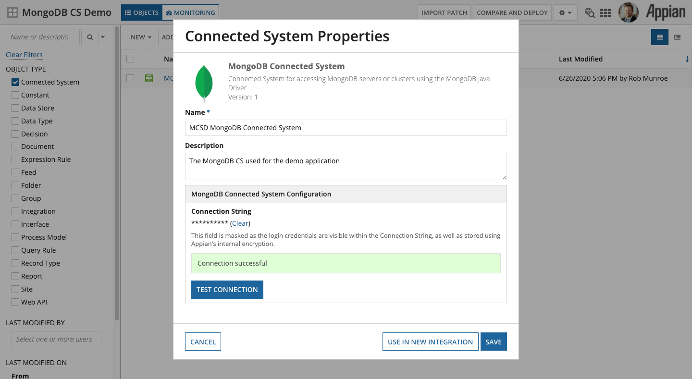
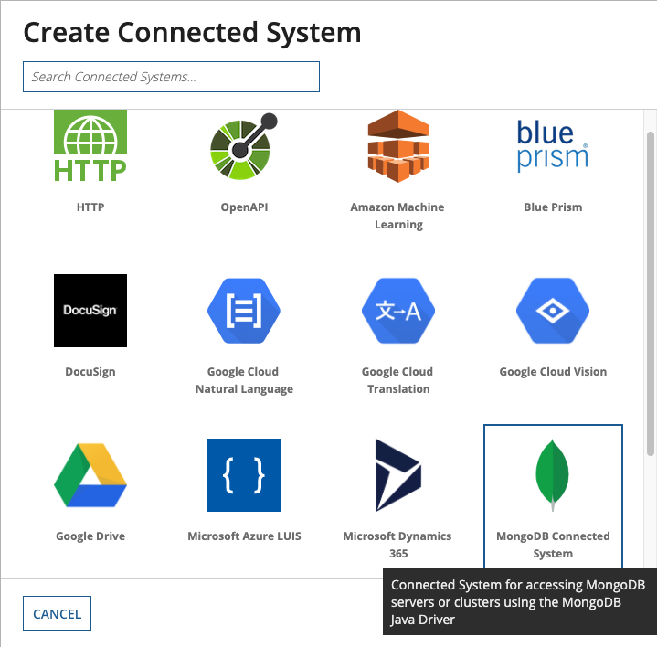
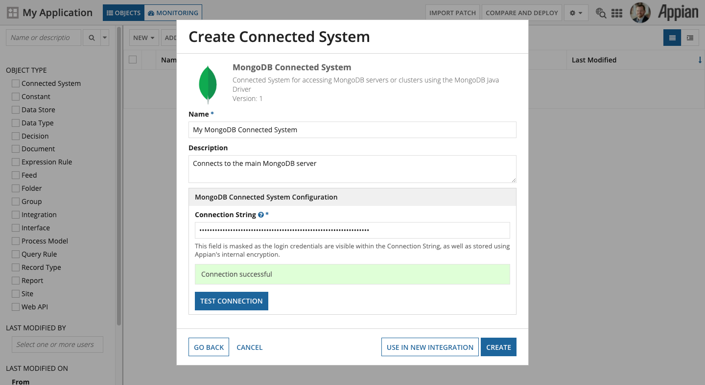

################
Connected System
################

This plugin provides a single Connected System Template for connecting to MongoDB named **MongoDB Connected System**. Configuration of the Connected System is very simple and only requires the `MongoDB Connection String <https://docs.mongodb.com/manual/reference/connection-string/>`_.

.. important:: It is up to you to fully understand the MongoDB Connection String format, as many parameters can be set that affect the functionality of the `MongoDB Java Driver <https://mongodb.github.io/mongo-java-driver/3.12/>`_ used by this plugin. 

A good rule of thumb is if you can connect to and work with your MongoDB Database using your Connection String in the `MongoDB Compass <https://www.mongodb.com/products/compass>`_ application, you should have no issue using that Connection String with this Connected System.

The first step in using this plugin is to ensure it has been installed in your Appian environment. Please refer to the `Appian Documentation for installing plugins <https://docs.appian.com/suite/help/20.2/Appian_Administration_Console.html#plug-ins>`_.

To add a new MongoDB Connected System in your Application, open the application in Designer, and click **New > Connected System**.

Select the **MongoDB Connected System**

Give it a **Name** and **Description**, and then paste your MongoDB **Connection String** in the provided text box and click **Test Connection**. Assuming you see "*Connection successful*" then simply click the **Create** button to finish.

