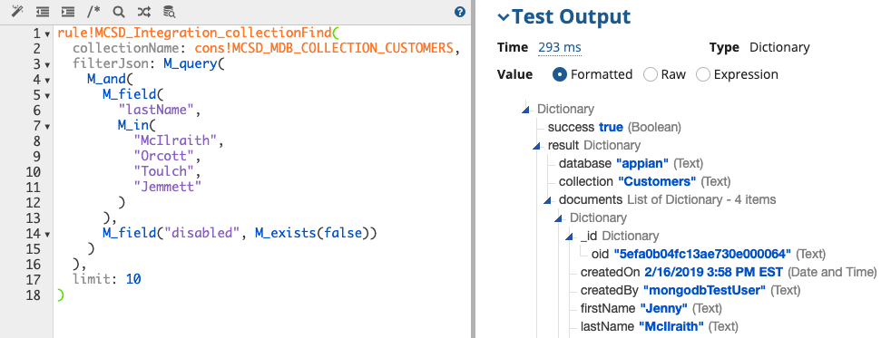
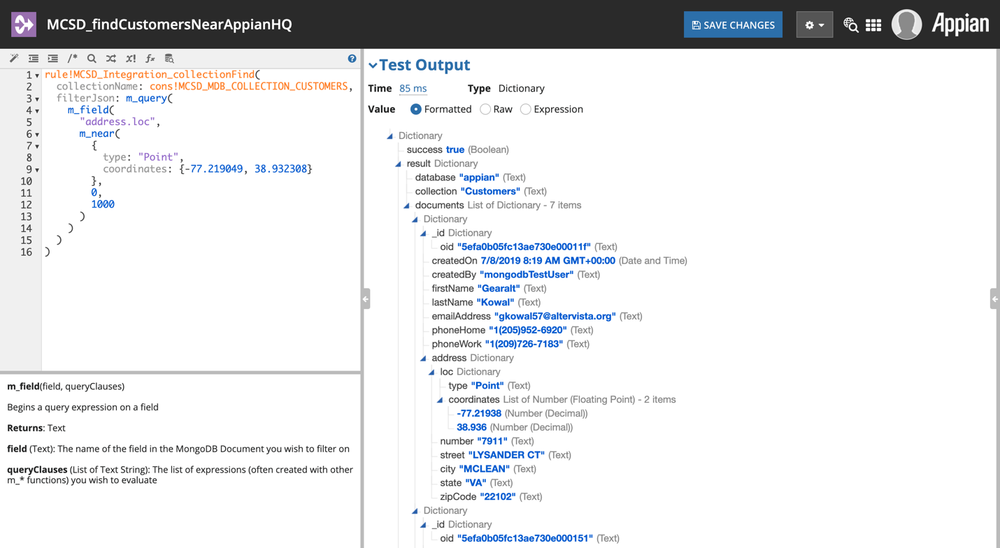

.. _JSON Query Expression Functions:

###############################
JSON Query Expression Functions
###############################

As many Integration Operation parameters take as input JSON expressions, such as those for filtering MongoDB Documents in :ref:`READ Collection Find`, we have included a set of Expression Functions to help create these JSON Query expressions without having to construct the strings yourself.

In addition to generating the special JSON structures MongoDB expects, these functions make creating MongoDB’s non-standard JSON alterations much easier in Appian. The functions also handle converting Appian primitive types to their necessary JSON representations. For example, this expression:

.. code-block:: 

  M_query(
    M_field(
      "createdOn",
      M_eq(now())
    )
  )

Would produce this JSON:

.. code-block:: JSON

  {
    "createdOn": {
      "$eq": ISODate("2020-07-01T20:32:20.900Z")
    }
  }

Note the MongoDB-specific JSON ``ISODate()`` function call. Also note the field names that begin with ``$``. It is not easy (and, in some cases such as this one, not possible) to generate JSON in this manner by constructing Dictionaries and using Appian’s built-in ``a!toJson()`` function.

More MongoDB query functions may be added in later versions of this plugin. If there are any you would like to see added, please :ref:`contact the project authors <Project Info>` or on the `Community App Market <https://community.appian.com/b/appmarket/posts/mongodb-connected-system>`_ entry. 

*******************
Top-Level Functions
*******************

``M_query()``
=============

This function begins a MongoDB query. It should be the top-level function call whose output is sent to one of the JSON filter parameters. Essentially this wraps the contents provided in braces ``{ ... }`` to ensure a complete query JSON string.

**queryClauses** *(List of Text String)*: The list of expressions (often created with `M_field()`_) you wish to evaluate

For example, this expression:

.. code-block:: 

  M_query(
    M_field("createdOn", M_eq(fn!datetime(2019,4,26,10,28,57,0)))
  )

Would produce this JSON:

.. code-block:: JSON

  {
    "createdOn": {
      "$eq": ISODate("2019-04-26T10:28:57.000Z")
    }
  }

``M_field()``
=============

This function begins a query expression on a field, in the form of ``fieldName: ...`` where the passed in queryClauses are joined to complete the expression. To be used within `M_query()`_ or one of the other Expression Functions that take in a complete field, such as `M_and()`_.

**field** *(Text)*: The name of the field in the MongoDB Document you wish to filter on

**queryClauses** *(List of Text String)*: The list of expressions (often created with other ``m_*`` functions) you wish to evaluate

For example, this expression:

.. code-block::

  M_field("createdOn", M_eq(fn!datetime(2019,4,26,10,28,57,0)))
  
Would produce this portion of JSON:

.. code-block:: JSON

  "createdOn": { "$eq": ISODate("2019-04-26T10:28:57.000Z") }

**************************
Comparison Query Operators
**************************

These functions correspond directly to the `Comparison Query Operators <https://docs.mongodb.com/manual/reference/operator/query-comparison/>`_ provided by the MongoDB Query language.

These functions handle converting Appian primitive types to their necessary JSON representations. For example, this expression:

.. code-block:: 

  M_query(
    M_field(
      "createdOn",
      M_eq(now())
    )
  )

Would produce this JSON:

.. code-block:: JSON

  {
    "createdOn": {
      "$eq": ISODate("2020-07-01T20:32:20.900Z")
    }
  }

Note the MongoDB-specific ``ISODate()`` function call. It is not possible to generate JSON in this manner using Appian’s built-in ``a!toJson()`` function.

``M_eq()``
==========

Implements the `$eq <https://docs.mongodb.com/manual/reference/operator/query/eq/>`_ operator. Specifies equality condition. The ``$eq`` operator matches documents where the value of a field equals the specified value.

**value** *(Any Type)*: The value to evaluate against.

``M_gt()``
==========

Implements the `$gt <https://docs.mongodb.com/manual/reference/operator/query/gt/>`_ operator. Selects those documents where the value of the field is greater than (i.e. ``>``) the specified value.

**value** *(Any Type)*: The value to evaluate against.

``M_gte()``
===========

Implements the `$gte <https://docs.mongodb.com/manual/reference/operator/query/gte/>`_ operator. Selects the documents where the value of the field is greater than or equal to (i.e. ``>=``) a specified value (e.g. value.)

**value** *(Any Type)*: The value to evaluate against.

``M_in()``
==========

Implements the `$in <https://docs.mongodb.com/manual/reference/operator/query/in/>`_ operator. Selects the documents where the value of a field equals any value in the specified array.

**array** *(List of Variant)*: The array of values to evaluate against.

``M_lt()``
==========

Implements the `$lt <https://docs.mongodb.com/manual/reference/operator/query/lt/>`_ operator. Selects the documents where the value of the field is less than (i.e. ``<``) the specified value.

**value** *(Any Type)*: The value to evaluate against.

``M_lte()``
===========

Implements the `$lte <https://docs.mongodb.com/manual/reference/operator/query/lte/>`_ operator. Selects the documents where the value of the field is less than or equal to (i.e. ``<=``) the specified value.

**value** *(Any Type)*: The value to evaluate against.

``M_ne()``
==========

Implements the `$ne <https://docs.mongodb.com/manual/reference/operator/query/ne/>`_ operator. Selects the documents where the value of the field is not equal to the specified value. This includes documents that do not contain the field.

**value** *(Any Type)*: The value to evaluate against.

``M_nin()``
===========

Implements the `$nin <https://docs.mongodb.com/manual/reference/operator/query/nin/>`_ operator. Selects the documents where the field value is not in the specified array or the field does not exist.

**array** *(List of Variant)*: The array of values to evaluate against.

***********************
Logical Query Operators
***********************

These functions correspond directly to the `Logical Query Operators <https://docs.mongodb.com/manual/reference/operator/query-logical/>`_ provided by the MongoDB Query language.

For example, this expression:

.. code-block:: 

  M_query(
    M_and(
      M_field(
        "lastName",
        M_in(
          "McIlraith",
          "Orcott",
          "Toulch",
          "Jemmett"
        )
      ),
      M_field("disabled", M_ne(true))
    )
  )

Would produce this JSON:

.. code-block:: JSON

  {
    "$and": [
      {
        "lastName": {
          "$in": [
            "McIlraith",
            "Orcott",
            "Toulch",
            "Jemmett"
          ]
        }
      },
      {
        "disabled": {
          "$ne": true
        }
      }
    ]
  }

``M_and()``
===========

Implements the `$and <https://docs.mongodb.com/manual/reference/operator/query/and/>`_ operator. Performs a logical **AND** operation on an array of one or more expressions (e.g. expression1, expression2, etc.) and selects the documents that satisfy all the expressions in the array. The ``$and`` operator uses short-circuit evaluation. If the first expression (e.g.  expression1) evaluates to false, MongoDB will not evaluate the remaining expressions.

**queryExpressions** *(List of Text String)*: The list of expressions (often created with other ``M_*`` functions) you wish to evaluate against.

``M_nor()``
===========

Implements the `$nor <https://docs.mongodb.com/manual/reference/operator/query/nor/>`_ operator. Performs a logical **NOR** operation on an array of one or more query expressions and selects the documents that fail all the query expressions in the array.

**queryExpressions** *(List of Text String)*: The list of expressions (often created with other ``M_*`` functions) you wish to evaluate against.

``M_not()``
===========

Implements the `$not <https://docs.mongodb.com/manual/reference/operator/query/not/>`_ operator. Performs a logical **NOT** operation on the specified operator-expression and selects the documents that do not match the operator-expression. This includes documents that do not contain the field.

**queryExpression** *(Text)*: The expression (often created with other M_\* functions) you wish to evaluate against.

``M_or()``
==========

Implements the `$or <https://docs.mongodb.com/manual/reference/operator/query/or/>`_ operator. Performs a logical **OR** operation on an array of two or more expressions and selects the documents that satisfy at least one of the expressions.

**queryExpressions** *(List of Text String)*: The list of expressions (often created with other ``M_*`` functions) you wish to evaluate against.

***********************
Element Query Operators
***********************

These functions correspond directly to the `Element Query Operators <https://docs.mongodb.com/manual/reference/operator/query-element/>`_ provided by the MongoDB Query language.

``M_exists()``
==============

Implements the `$exists <https://docs.mongodb.com/manual/reference/operator/query/exists/>`_ operator. When value is ``true``, ``$exists`` matches the documents that contain the field, including documents where the field value is ``null``. If value is ``false``, the query returns only the documents that do not contain the field.

**value** *(Boolean)*: Whether it should exist or not.

``M_type()``
============

Implements the `$type <https://docs.mongodb.com/manual/reference/operator/query/type/>`_ operator. Selects documents where the value of the field is an instance of the specified BSON type(s). Querying by data type is useful when dealing with highly unstructured data where data types are not predictable.

**types** *(List of Variant)*: Either the BSON type numbers (integer) or aliases (string).

**************************
Evaluation Query Operators
**************************

These functions correspond directly to the `Evaluation Query Operators <https://docs.mongodb.com/manual/reference/operator/query-evaluation/>`_ provided by the MongoDB Query language.

``M_expr()``
============

Implements the `$expr <https://docs.mongodb.com/manual/reference/operator/query/expr/>`_ operator. Allows the use of aggregation expressions within the query language.

**queryExpression** *(Dictionary or Text)*: The expression (often created with other ``M_*`` functions) you wish to evaluate against.

``M_jsonSchema()``
==================

Implements the `$jsonSchema <https://docs.mongodb.com/manual/reference/operator/query/jsonSchema/>`_ operator. Matches documents that satisfy the specified JSON Schema.

**jsonSchema** *(Dictionary or Text)*: The JSON Schema object as an Appian Dictionary or a JSON string, formatted according to `draft 4 of the JSON Schema standard <https://tools.ietf.org/html/draft-zyp-json-schema-04>`_.

``M_mod()``
===========

Implements the `$mod <https://docs.mongodb.com/manual/reference/operator/query/mod/>`_ operator. Select documents where the value of a field divided by a divisor has the specified remainder (i.e. perform a modulo operation to select documents).

**divisor** *(Number (Integer))*: The divisor value.

**remainder** *(Number (Integer))*: The remainder value.

``M_regex()``
=============

Implements the `$regex <https://docs.mongodb.com/manual/reference/operator/query/regex/>`_ operator. Provides regular expression capabilities for pattern matching strings in queries. MongoDB uses Perl compatible regular expressions (i.e. "PCRE") version 8.42 with UTF-8 support.

**regex** *(Text)*: The regular expression (without enclosing slashes), e.g. ``"^foo.\*bar$"``

**options** *(Text)*: The regular expression options modifiers (``"i"``, ``"m"``, ``"s"``, and/or ``"x"``), e.g. ``"im"`` for 'ignore case' and 'multiline' searches

This example would match all MongoDB Documents where the last name begins with "St":

.. code-block:: 

  M_query(
    M_field(
      "lastName",
      M_regex("^St", "i")
    )
  )

Which would produce this JSON:

.. code-block:: JSON

  {
    "lastName": {
      "$regex": /^St/i
    }
  }

``M_text()``
============

Implements the `$text <https://docs.mongodb.com/manual/reference/operator/query/text/>`__ operator. Performs a text search on the content of the fields indexed with a text index.

**search** *(Text)*: A string of terms that MongoDB parses and uses to query the text index. MongoDB performs a logical **OR** search of the terms unless specified as a phrase.

**language** *(Text)*: Optional (use ``null`` to omit). The language that determines the list of stop words for the search and the rules for the stemmer and tokenizer. If not specified, the search uses the default language of the index.

**caseSensitive** *(Boolean)*: Optional (use ``null`` to omit). A boolean flag to enable or disable case sensitive search. Defaults to ``false``; i.e. the search defers to the case insensitivity of the text index.

**diacriticSensitive** *(Boolean)*: Optional (use ``null`` to omit). A boolean flag to enable or disable diacritic sensitive search against version 3 text indexes. Defaults to ``false``; i.e. the search defers to the diacritic insensitivity of the text index.

``M_where()``
=============

Implements the `$where <https://docs.mongodb.com/manual/reference/operator/query/where/>`_ operator. Use the ``$where`` operator to pass either a string containing a JavaScript expression or a full JavaScript function to the query system.  The ``$where`` provides greater flexibility but requires that the database processes the JavaScript expression or function for each document in the collection. Reference the document in the JavaScript expression or function using either ``this`` or ``obj``. Please see `full documentation <https://docs.mongodb.com/manual/reference/operator/query/where/>`_ for caveats and performance topics.

**javaScript** *(Text)*: A JavaScript expression or a full JavaScript function.

This example would match all MongoDB Documents where the last name equals "Gudgen":

.. code-block:: 

  M_query(
    M_where("function() { return (hex_md5(this.lastName) == '9af26c4c8b156852e86d49566d96a0d1') }")
  )

Which would produce this JSON:

.. code-block:: JSON

  {
    "$where": "function() { return (hex_md5(this.lastName) == \'9af26c4c8b156852e86d49566d96a0d1\') }"
  }

*********************
Array Query Operators
*********************

These functions correspond directly to the `Array Query Operators <https://docs.mongodb.com/manual/reference/operator/query-array/>`_ provided by the MongoDB Query language.

``M_all()``
===========

Implements the `$all <https://docs.mongodb.com/manual/reference/operator/query/all/>`_ operator. Selects the documents where the value of a field is an array that contains all of the specified elements.

**array** *(List of Variant)*: The array of values to evaluate against.

``M_elemMatch()``
=================

Implements the `$elemMatch <https://docs.mongodb.com/manual/reference/operator/query/elemMatch/>`_ operator. Matches documents that contain an array field with at least one element that matches all the specified query criteria.

**queryExpressions** *(List of Text String)*: The list of expressions (often created with other ``M_*`` functions) you wish to evaluate against.

``M_size()``
============

Implements the `$size <https://docs.mongodb.com/manual/reference/operator/query/size/>`_ operator. Matches any array with the number of elements specified by the argument.

**value** *(Number (Integer))*: The number of elements to evaluate for.

**************************
Geospatial Query Operators
**************************

These functions correspond directly to the `Geospatial Query Operators <https://docs.mongodb.com/manual/reference/operator/query-geospatial/>`_ provided by the MongoDB Query language.

.. note:: Many of the following geospatial query operators require that a geospatial index be added to the fields you wish to query. See `MongoDB documentation <https://docs.mongodb.com/manual/geospatial-queries/#geospatial-indexes>`_ for more information.

``M_toPoint()``
===============

Returns a Point CDT instance with the given coordinates. Used any time a ``[longitude, latitude]`` pair is required in the following Expression Functions.

**longitude** *(Number (Decimal))*: The longitude of the point.

**latitude** *(Number (Decimal))*: The latitude of the point.

``M_geoIntersects()``
=====================

Implements the `$geoIntersects <https://docs.mongodb.com/manual/reference/operator/query/geoIntersects/>`_ operator. Selects documents whose geospatial data intersects with a specified `GeoJSON <https://docs.mongodb.com/manual/reference/geojson/>`_ object; i.e. where the intersection of the data and the specified object is non-empty.

**geoJson** *(Dictionary or Text)*: A `GeoJSON <https://docs.mongodb.com/manual/reference/geojson/>`_ object, as an Appian Dictionary or a JSON string.

``M_geoWithin()``
=================

Implements the `$geoWithin <https://docs.mongodb.com/manual/reference/operator/query/geoWithin/>`_ operator. Selects documents with geospatial data that exists entirely within a specified shape.

**geoJson** *(Dictionary or Text)*: A `GeoJSON <https://docs.mongodb.com/manual/reference/geojson/>`_ object, as an Appian Dictionary or a JSON string.

``M_geoWithinBox()``
====================

Implements the `$geoWithin <https://docs.mongodb.com/manual/reference/operator/query/geoWithin/>`__ operator, using a `$box <https://docs.mongodb.com/manual/reference/operator/query/box/>`_ to search within. Selects documents with geospatial data that exists entirely the bounds of the given rectangle, according to their point-based location data.

**bottomLeft** *(Point)*: Point with the coordinates of the bottom-left corner of the box.

**topRight** *(Point)*: Point with the coordinates of the top-right corner of the box.

``M_geoWithinCircle()``
=======================

Implements the `$geoWithin <https://docs.mongodb.com/manual/reference/operator/query/geoWithin/>`_ operator, using a `$center <https://docs.mongodb.com/manual/reference/operator/query/center/>`_ (circle) to search within. Selects documents with geospatial data that exists entirely the bounds of the given circle, defined by a center point and radius.

**centerPoint** *(Point)*: Point with the coordinates of the center of the circle.

**radius** *(Number (Decimal))*: The radius of the circle, as measured in the units used by the coordinate system.

``M_geoWithinSphere()``
=======================

Implements the `$geoWithin <https://docs.mongodb.com/manual/reference/operator/query/geoWithin/>`_ operator, using a `$centerSphere <https://docs.mongodb.com/manual/reference/operator/query/centerSphere/>`_ to search within. Selects documents with geospatial data that exists entirely the bounds of the given sphere, defined by a center point and radius.

**centerPoint** *(Point)*: Point with the coordinates of the center of the sphere.

**radius** *(Number (Decimal))*: The radius of the sphere, as measured in the units used by the coordinate system.

``M_geoWithinPolygon()``
========================

Implements the `$geoWithin <https://docs.mongodb.com/manual/reference/operator/query/geoWithin/>`_ operator, using a `$polygon <https://docs.mongodb.com/manual/reference/operator/query/polygon/>`_ to search within. Selects documents with geospatial data that exists entirely the bounds of the given polygon, defined by an array of GeoPoints.

This example would match all MongoDB Documents where the address’s ``loc`` field (a `Point <https://docs.mongodb.com/manual/reference/geojson/#point>`_) is within an area roughly outlining McLean, VA:

.. code-block:: 

  M_query(
    M_field(
      "address.loc",
      m_geoWithinPolygon({
        M_toPoint(-77.210903, 38.970481),
        M_toPoint(-77.145100, 38.964342),
        M_toPoint(-77.118225, 38.935857),
        M_toPoint(-77.172360, 38.893213),
        M_toPoint(-77.189069, 38.896396),
        M_toPoint(-77.198767, 38.926490),
        M_toPoint(-77.233222, 38.933877),
        M_toPoint(-77.226622, 38.962158)
      })
    )
  )

Which would produce this JSON:

.. code-block:: JSON

   {
    "address.loc": {
      "$geoWithin": {
        "$polygon": [
          [ -77.210903, 38.970481 ],
          [ -77.1451, 38.964342 ],
          [ -77.118225, 38.935857 ],
          [ -77.17236, 38.893213 ],
          [ -77.189069, 38.896396 ],
          [ -77.198767, 38.92649 ],
          [ -77.233222, 38.933877 ],
          [ -77.226622, 38.962158 ]
        ]
      }
    }
  }

**polygonPoints** *(List of Point)*: Array of GeoPoints representing the polygon to search within. Be sure to pass an actual Appian Array here inside of brackets ({}).

``M_near()``
============

Implements the `$near <https://docs.mongodb.com/manual/reference/operator/query/near/>`_ operator. Specifies a point for which a geospatial query returns the documents from nearest to farthest.

This example would match all MongoDB Documents where the address’s loc field (a `Point <https://docs.mongodb.com/manual/reference/geojson/#point>`_) is within 1 km of Appian HQ:

.. code-block:: 

  M_query(
    M_field(
      "address.loc",
      M_near(
        {
          type: "Point",
          coordinates: M_toPoint(-77.219049, 38.932308)
        },
        0,
        1000
      )
    )
  )

Which would produce this JSON:

.. code-block:: JSON

  {
    "address.loc": {
      "$near": {
        "$geometry": {
          "type": "Point",
          "coordinates": [ -77.219049, 38.932308 ]
        },
        "$minDistance": 0.0,
        "$maxDistance": 1000.0
      }
    }
  }

**geoJson** *(Dictionary or Text)*: A `GeoJSON <https://docs.mongodb.com/manual/reference/geojson/>`_ object, as an Appian Dictionary or a JSON string.

**minDistance** *(Number (Decimal))*: Minimum distance in meters.

**maxDistance** *(Number (Decimal))*: Maximum distance in meters.

``M_nearSphere()``
==================

Implements the `$nearSphere <https://docs.mongodb.com/manual/reference/operator/query/nearSphere/>`_ operator. Specifies a point for which a geospatial query returns the documents from nearest to farthest. MongoDB calculates distances for ``$nearSphere`` using spherical geometry.

**geoJson** *(Dictionary or Text)*: A `GeoJSON <https://docs.mongodb.com/manual/reference/geojson/>`_ object, as an Appian Dictionary or a JSON string.

**minDistance** *(Number (Decimal))*: Minimum distance in meters.

**maxDistance** *(Number (Decimal))*: Maximum distance in meters.

***********************
Query Operator Examples
***********************

Date and Time Examples
======================

Query for Dates in a Range
--------------------------

This expression will produce a query for finding MongoDB Documents with createdOn in the month of December 2019:

.. code-block:: 

  M_query(
    M_field(
      "createdOn",
      M_gte(date(2019, 12, 1)),
      M_lt(date(2020, 1, 1))
    )
  )

Which produces this JSON:

.. code-block:: JSON

  {
    "createdOn": {
      "$gte": ISODate("2019-12-01T00:00:00.000Z"),
      "$lt": ISODate("2020-01-01T00:00:00.000Z")
    }
  }

Querying by Date Without Time
-----------------------------

As mentioned earlier, MongoDB stores all dates in UTC and does not have a date without time. Similar to above, in order to find all MongoDB Documents with createdOn on a single day, use $gte of that day:

.. code-block:: 

  M_query(
    M_field(
      "createdOn",
      M_gte(date(2019, 12, 1)),
      M_lt(date(2020, 1, 1))
    )
  )

Which produces this JSON:

.. code-block:: JSON

  {
    "createdOn": {
      "$gte": ISODate("2019-12-01T00:00:00.000Z"),
      "$lt": ISODate("2020-01-01T00:00:00.000Z")
    }
  }

More examples will be added in newer versions of this plugin.

