############
Integrations
############

Creating an Integration will be the same steps for all Integration operations listed below. Start by clicking **New > Integration** in your application in Designer.

Enter the name of your MongoDB **Connected System** object, select the Integration **Operation**, then give it a **Name** and **Description** and the folder to **Save In** and click **Create**.

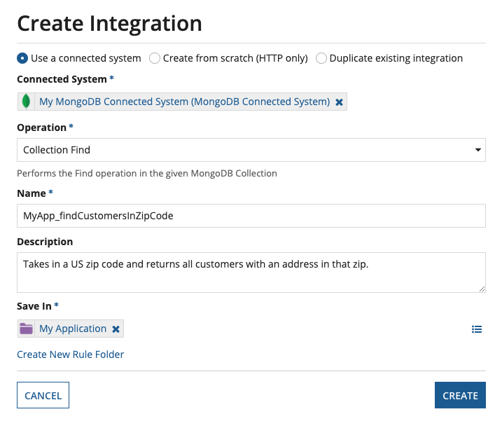

Each Integration Operation will be configured differently, as noted below.

.. note:: Unless noted otherwise, all parameters in all Integration Operations are expressionable, meaning that they can be mapped to rule inputs or otherwise derived at runtime.

***************************
READ Integration Operations
***************************

This section details all Integration Operations supported by the Connected System in a **READ** context. They can be used anywhere that Expressions are evaluated.

.. _READ List Databases:

List Databases
==============

This Integration executes the `List Databases <https://docs.mongodb.com/manual/reference/command/listDatabases/>`_ operation to list all Databases available in the Connected System instance.

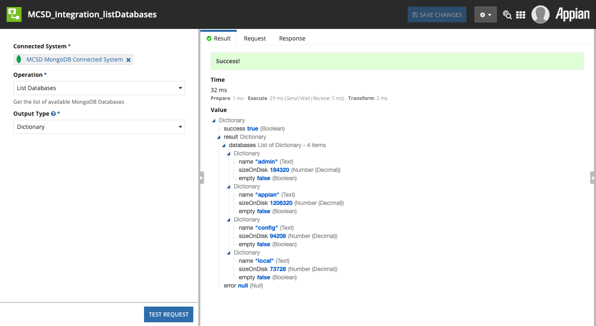

The ``result.databases.name`` property is the MongoDB Database name that can be used as any Integration Operation's :ref:`Common Database` parameter value.

Parameters
----------

*Output Type*
^^^^^^^^^^^^^

Refer to :ref:`Common Output Type` in Common Configuration Parameters.

Result Value
------------

+------------------+----------------------+---------------------------------------------------------------------------------------------------------------------------------------+
| **Field Name**   | **Data Type**        | **Description**                                                                                                                       |
+------------------+----------------------+---------------------------------------------------------------------------------------------------------------------------------------+
| ``databases``    | *List of Dictionary* | Dictionaries represent the `List Databases output data <https://docs.mongodb.com/manual/reference/command/listDatabases/#output>`_    |
+------------------+----------------------+---------------------------------------------------------------------------------------------------------------------------------------+

.. _READ List Collections:

List Collections
================

This Integration executes the `List Collections <https://docs.mongodb.com/manual/reference/command/listCollections/>`_ operation to list all MongoDB Collections in the given Database available to the connected user.

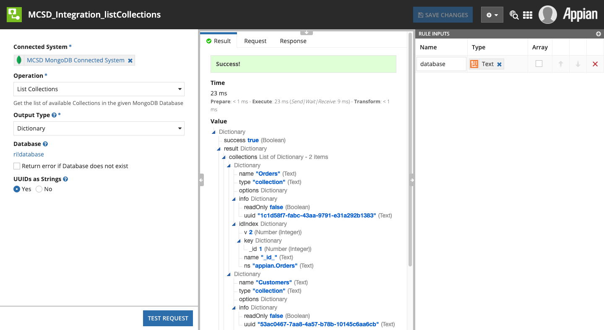

Parameters
----------

*Output Type*
^^^^^^^^^^^^^

Refer to :ref:`Common Output Type` in Common Configuration Parameters.

*Database*
^^^^^^^^^^

Refer to :ref:`Common Database` in Common Configuration Parameters.

*UUIDs as String*
^^^^^^^^^^^^^^^^^

MongoDB stores UUIDs as a special data type internally. When returned to Appian, they are sub-dictionaries with several properties. Chances are this is not as useful to you, so setting **Yes** here will ensure the string representation of the UUID is returned instead of the sub-dictionary.

Result Value
------------

+------------------+----------------------+-------------------------------------------------------------------------------------------------------------------------------------------+
| **Field Name**   | **Data Type**        | **Description**                                                                                                                           |
+------------------+----------------------+-------------------------------------------------------------------------------------------------------------------------------------------+
| ``collections``  | *List of Dictionary* | Dictionaries represent the `List Collections output data <https://docs.mongodb.com/manual/reference/command/listCollections/#output>`_    |
+------------------+----------------------+-------------------------------------------------------------------------------------------------------------------------------------------+
| ``database``     | *Text*               | The database used                                                                                                                         |
+------------------+----------------------+-------------------------------------------------------------------------------------------------------------------------------------------+

.. _READ Collection Find:

Collection Find
===============

Performs the `Find <https://docs.mongodb.com/manual/reference/method/db.collection.find/>`_ operation in the given MongoDB Collection and returns the matching MongoDB Documents. This is the standard operation for querying MongoDB Documents.

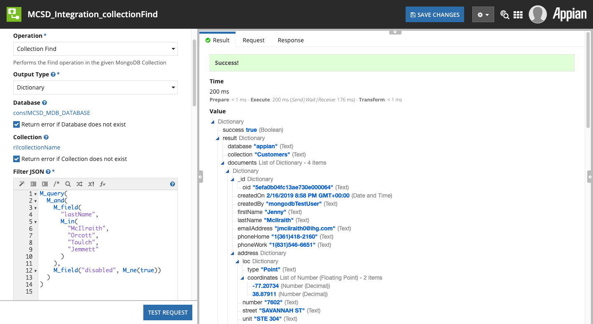

Parameters
----------

*Output Type*
^^^^^^^^^^^^^

Refer to :ref:`Common Output Type` in Common Configuration Parameters.

*Database*
^^^^^^^^^^

Refer to :ref:`Common Database` in Common Configuration Parameters.

*Collection*
^^^^^^^^^^^^

Refer to :ref:`Common Collection` in Common Configuration Parameters.

*Filter JSON*
^^^^^^^^^^^^^

Refer to :ref:`Common Filter JSON` in Common Configuration Parameters.

*Sort JSON*
^^^^^^^^^^^

A JSON string representing the sort order for a ``Collection.Find()`` query.  Sort specifies the order in which the query returns matching documents.  Example, sorting by last name ascendingly, then first name ascendingly:

.. code-block:: JSON

    { "lastName": 1, "firstName": 1 }

*Projection JSON*
^^^^^^^^^^^^^^^^^

A JSON string representing a `Projection <https://docs.mongodb.com/manual/tutorial/project-fields-from-query-results/>`_ for a ``Collection.Find()`` query. Projections limit the amount of data that MongoDB returns.

Example, returning MongoDB Documents that only contain first name, last name, and postal code, and omits the \_id (which is always projected unless omitted):

.. code-block:: JSON

    { "firstName": 1, "lastName": 1, "address.postalCode": 1, _id: 0 }

*Limit*
^^^^^^^

Sets the number of MongoDB Document results to return. Useful for mapping ``a!pagingInfo.batchSize`` to use paging in your queries.

*Skip*
^^^^^^

Sets the number of MongoDB Document results to skip before returning.  Useful for mapping ``a!pagingInfo.startIndex`` to use paging in your queries.

*Collation*
^^^^^^^^^^^

Refer to :ref:`Common Collation` in Common Configuration Parameters.

*Max Processing Time*
^^^^^^^^^^^^^^^^^^^^^

Specifies a cumulative time limit in milliseconds for **processing** operations on a Find operation. Note that this is not the complete time to perform the Integration Operation, nor the entire query on the MongoDB server, but only the time MongoDB is processing the query.

*Read Preference*
^^^^^^^^^^^^^^^^^

Refer to :ref:`Common Read Preference` in Common Configuration Parameters.

*Read Concern*
^^^^^^^^^^^^^^

Refer to :ref:`Common Read Concern` in Common Configuration
Parameters.

*Include Record Id*
^^^^^^^^^^^^^^^^^^^

Modifies the output of a query by adding a field ``recordId`` to matching MongoDB Documents. Record Id is the internal key which uniquely identifies a MongoDB Document in a Collection. 

.. note:: This is different from a MongoDB Document's Object Id.

Result Value
------------

+------------------+--------------------------------------------+----------------------------------------------------------------------------------------------------------------------------------------+
| **Field Name**   | **Data Type**                              | **Description**                                                                                                                        |
+------------------+--------------------------------------------+----------------------------------------------------------------------------------------------------------------------------------------+
| ``database``     | *Text*                                     | The database used                                                                                                                      |
+------------------+--------------------------------------------+----------------------------------------------------------------------------------------------------------------------------------------+
| ``collection``   | *Text*                                     | The collection used                                                                                                                    |
+------------------+--------------------------------------------+----------------------------------------------------------------------------------------------------------------------------------------+
| ``documents``    | *List of Dictionary* **OR** *List of Text* | The MongoDB Documents matched by the Filter JSON query, either as Dictionaries or JSON strings depending on the Output Type selected   |
+------------------+--------------------------------------------+----------------------------------------------------------------------------------------------------------------------------------------+

Collection Count
================

Performs the `Count <https://docs.mongodb.com/manual/reference/method/db.collection.count/>`_ operation on the Collection, returning the number of MongoDB Documents that match the provided Filter JSON.

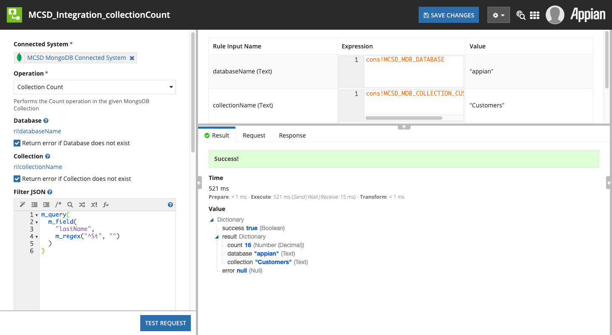

This is useful for determining how many total results match a given Filter JSON without returning the data. Using this in conjunction with :ref:`Collection Find <READ Collection Find>` and ``a!pagingInfo()`` allows for complete paging of your queries.

Parameters
----------

*Database*
^^^^^^^^^^

Refer to :ref:`Common Database` in Common Configuration Parameters.

*Collection*
^^^^^^^^^^^^

Refer to :ref:`Common Collection` in Common Configuration Parameters.

*Filter JSON*
^^^^^^^^^^^^^

Refer to :ref:`Common Filter JSON` in Common Configuration Parameters.

*Collation*
^^^^^^^^^^^

Refer to :ref:`Common Collation` in Common Configuration Parameters.

*Read Preference*
^^^^^^^^^^^^^^^^^

Refer to :ref:`Common Read Preference` in Common Configuration Parameters.

*Read Concern*
^^^^^^^^^^^^^^

Refer to :ref:`Common Read Concern` in Common Configuration Parameters.

Result Value
------------

+------------------+--------------------+--------------------------------------------------------------+
| **Field Name**   | **Data Type**      | **Description**                                              |
+------------------+--------------------+--------------------------------------------------------------+
| ``database``     | *Text*             | The database used                                            |
+------------------+--------------------+--------------------------------------------------------------+
| ``collection``   | *Text*             | The collection used                                          |
+------------------+--------------------+--------------------------------------------------------------+
| ``count``        | *Number (Integer)* | The number of MongoDB Documents matched by the Filter JSON   |
+------------------+--------------------+--------------------------------------------------------------+

Collection Aggregate
====================

Performs the `Aggregate <https://docs.mongodb.com/manual/aggregation/>`_ operation, taking in an `Aggregation Pipeline <https://docs.mongodb.com/manual/core/aggregation-pipeline/>`_ in the form of a single Text parameter that represents an array of JSON pipeline operations.

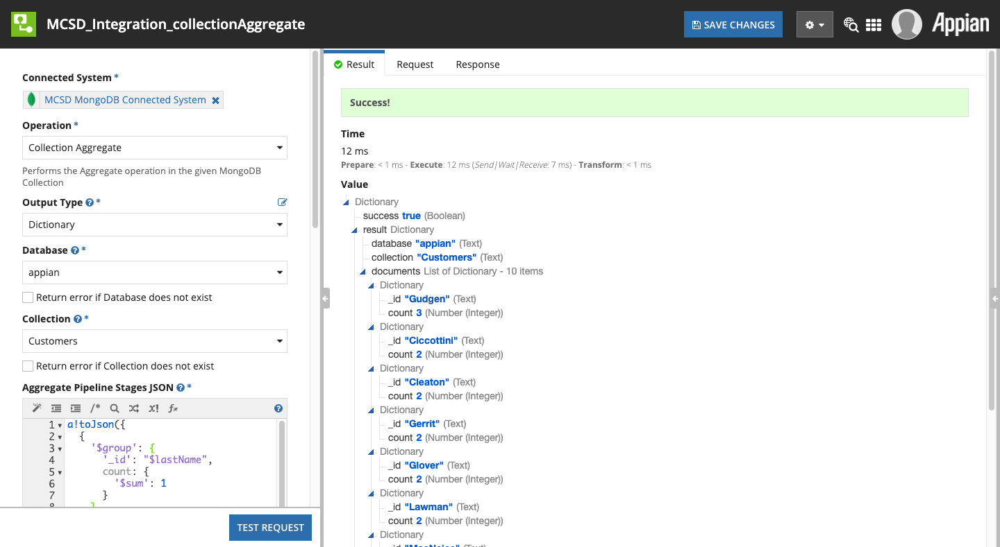

Aggregates are MongoDB's method of performing analytic operations on Collections, allowing for operations such as ``$match`` and ``$group``. Please see the MongoDB documentation for further details.

Parameters
----------

*Output Type*
^^^^^^^^^^^^^

Refer to :ref:`Common Output Type` in Common Configuration Parameters.

*Database*
^^^^^^^^^^

Refer to :ref:`Common Database` in Common Configuration Parameters.

*Collection*
^^^^^^^^^^^^

Refer to :ref:`Common Collection` in Common Configuration Parameters.

*Aggregate Pipeline Stages JSON*
^^^^^^^^^^^^^^^^^^^^^^^^^^^^^^^^

This parameter allows you to provide a collection of "stages" of an Aggregate Pipeline in the form of a single Text value that represents an array of JSON pipeline operations. For example, this JSON value represents an Aggregate Pipeline that returns the top 10 most common last names from a collection (e.g. Customers).

.. code-block:: JSON

  [
    {
      "$group": {
        "_id": "$lastName",
        "count": {
          "$sum": 1
        }
      }
    },
    {
      "$sort": {
        "count": -1,
        "_id": 1
      }
    },
    {
      "$limit": 10
    }
  ]

*Collation*
^^^^^^^^^^^

Refer to :ref:`Common Collation` in Common Configuration Parameters.

*Read Preference*
^^^^^^^^^^^^^^^^^

Refer to :ref:`Common Read Preference` in Common Configuration Parameters.

*Read Concern*
^^^^^^^^^^^^^^

Refer to :ref:`Common Read Concern` in Common Configuration Parameters.

Result Value
------------

+------------------+--------------------------------------------+-------------------------------------------------------------------------------------------------------------------------------------------+
| **Field Name**   | **Data Type**                              | **Description**                                                                                                                           |
+------------------+--------------------------------------------+-------------------------------------------------------------------------------------------------------------------------------------------+
| ``database``     | *Text*                                     | The database used                                                                                                                         |
+------------------+--------------------------------------------+-------------------------------------------------------------------------------------------------------------------------------------------+
| ``collection``   | *Text*                                     | The collection used                                                                                                                       |
+------------------+--------------------------------------------+-------------------------------------------------------------------------------------------------------------------------------------------+
| ``documents``    | *List of Dictionary* **OR** *List of Text* | The MongoDB Documents produced by the Aggregate operation, either as Dictionaries or JSON strings depending on the Output Type selected   |
+------------------+--------------------------------------------+-------------------------------------------------------------------------------------------------------------------------------------------+

****************************
WRITE Integration Operations
****************************

This section details all Integration Operations supported by the Connected System in a **WRITE** context. These Integrations can only be used in the `Call Integration Smart Service <https://docs.appian.com/suite/help/latest/Call_Integration_Smart_Service.html>`_, in a `Web API <https://docs.appian.com/suite/help/latest/Designing_Web_APIs.html>`_ that uses a **POST**, **PUT**, or **DELETE** Request, or in a SAIL `Save Into <https://docs.appian.com/suite/help/latest/enabling_user_interaction.html#saving-modified-or-alternative-values>`_ event.

Collection Find to JSON File
============================

Performs the `Find <https://docs.mongodb.com/manual/reference/method/db.collection.find/>`_ operation in the given MongoDB Collection and exports the results as JSON to an Appian Document. This is identical to the READ :ref:`READ Collection Find` operation except that a document is created from the output.

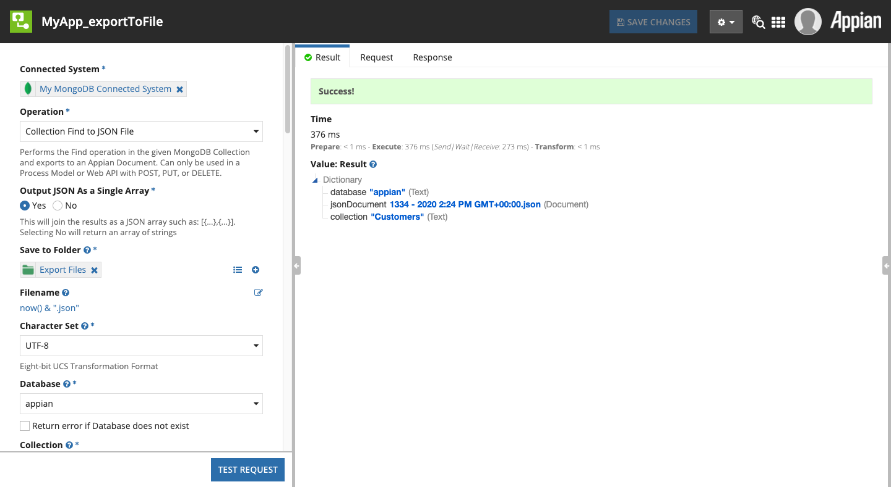

Parameters
----------

.. important:: Only the parameters that differ from the READ version of :ref:`READ Collection Find` above are discussed here. For all others, see :ref:`above <READ Collection Find>`.

*Output JSON As a Single Array*
^^^^^^^^^^^^^^^^^^^^^^^^^^^^^^^

Refer to :ref:`Common Output JSON As a Single Array` in Common Configuration Parameters.

*Save to Folder*
^^^^^^^^^^^^^^^^

Refer to :ref:`Common Save to Folder` in Common Configuration Parameters.

*Filename*
^^^^^^^^^^

Refer to :ref:`Common Filename` in Common Configuration Parameters.

*Character Set*
^^^^^^^^^^^^^^^

Refer to :ref:`Common Character Set` in Common Configuration Parameters.

Result Value
------------

+------------------+-------------------+--------------------------------------------------+
| **Field Name**   | **Data Type**     | **Description**                                  |
+------------------+-------------------+--------------------------------------------------+
| ``database``     | *Text*            | The database used                                |
+------------------+-------------------+--------------------------------------------------+
| ``collection``   | *Text*            | The collection used                              |
+------------------+-------------------+--------------------------------------------------+
| ``jsonDocument`` | *Appian Document* | The output file in Appian's content management   |
+------------------+-------------------+--------------------------------------------------+

Collection Aggregate to JSON File
=================================

Performs the Aggregate operation in the given MongoDB Collection and exports the results as JSON to an Appian Document. This is identical to the READ `Collection Aggregate`_ operation except that a document is created from the output.

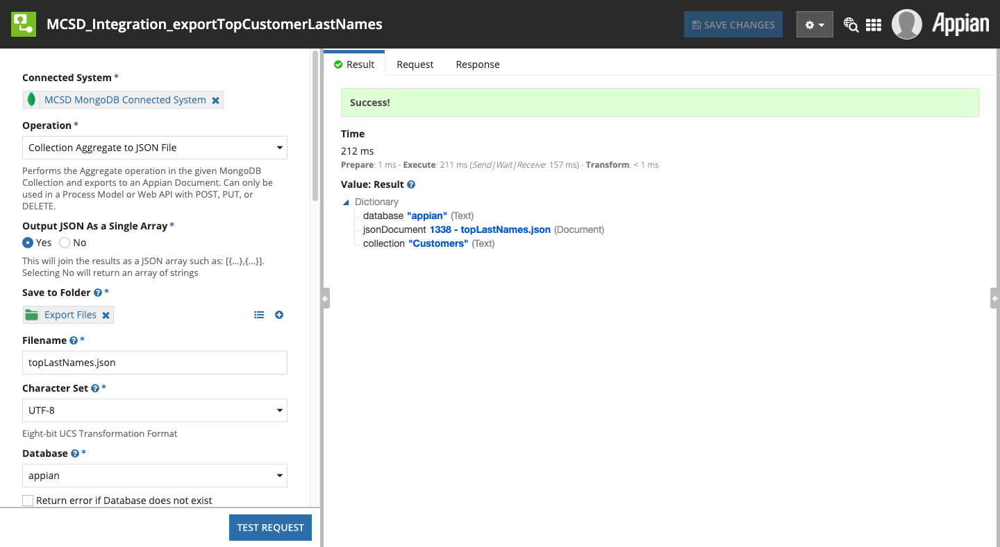

Parameters
----------

.. important:: Only the parameters that differ from the READ version of :ref:`READ Collection Find` above are discussed here. For all others, see :ref:`above <READ Collection Find>`.

*Output JSON As a Single Array*
^^^^^^^^^^^^^^^^^^^^^^^^^^^^^^^

Refer to :ref:`Common Output JSON As a Single Array` in Common Configuration Parameters.

*Save to Folder*
^^^^^^^^^^^^^^^^

Refer to :ref:`Common Save to Folder` in Common Configuration Parameters.

*Filename*
^^^^^^^^^^

Refer to :ref:`Common Filename` in Common Configuration Parameters.

*Character Set*
^^^^^^^^^^^^^^^

Refer to :ref:`Common Character Set` in Common Configuration Parameters.

Result Value
------------

+------------------+-------------------+--------------------------------------------------+
| **Field Name**   | **Data Type**     | **Description**                                  |
+------------------+-------------------+--------------------------------------------------+
| ``database``     | *Text*            | The database used                                |
+------------------+-------------------+--------------------------------------------------+
| ``collection``   | *Text*            | The collection used                              |
+------------------+-------------------+--------------------------------------------------+
| ``jsonDocument`` | *Appian Document* | The output file in Appian's content management   |
+------------------+-------------------+--------------------------------------------------+

Create Collection
=================

Performs the `Create Collection <https://docs.mongodb.com/manual/reference/method/db.createCollection/>`_ operation, explicitly creating a new Collection in the given Database.

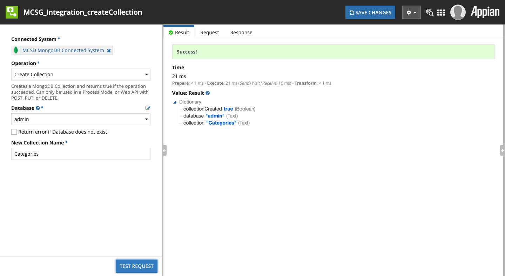

.. note:: It is possible to implicitly create a Collection using `Insert One in Collection`_ or `Insert Many in Collection`_ by specifying a **Collection** name that does not exist and ensuring that the **Return error if Collection does not exist** checkbox is not checked.

Parameters
----------

*Database*
^^^^^^^^^^

Refer to :ref:`Common Database` in Common Configuration Parameters.

*Collection Name*
^^^^^^^^^^^^^^^^^

The name of the new Collection to be created.

Result Value
------------

+-----------------------+-----------------+---------------------------------------------+
| **Field Name**        | **Data Type**   | **Description**                             |
+-----------------------+-----------------+---------------------------------------------+
| ``database``          | *Text*          | The database used                           |
+-----------------------+-----------------+---------------------------------------------+
| ``collection``        | *Text*          | The collection name provided                |
+-----------------------+-----------------+---------------------------------------------+
| ``collectionCreated`` | *Boolean*       | Whether the Collection was created or not   |
+-----------------------+-----------------+---------------------------------------------+

Create Index in Collection
==========================

Performs the `Create Index <https://docs.mongodb.com/manual/reference/method/db.collection.createIndex/>`_ operation, adding a new index in the given Collection.  `Indexes <https://docs.mongodb.com/manual/indexes/>`_ are critical for ensuring good performance on any operation that includes a Filter JSON value.

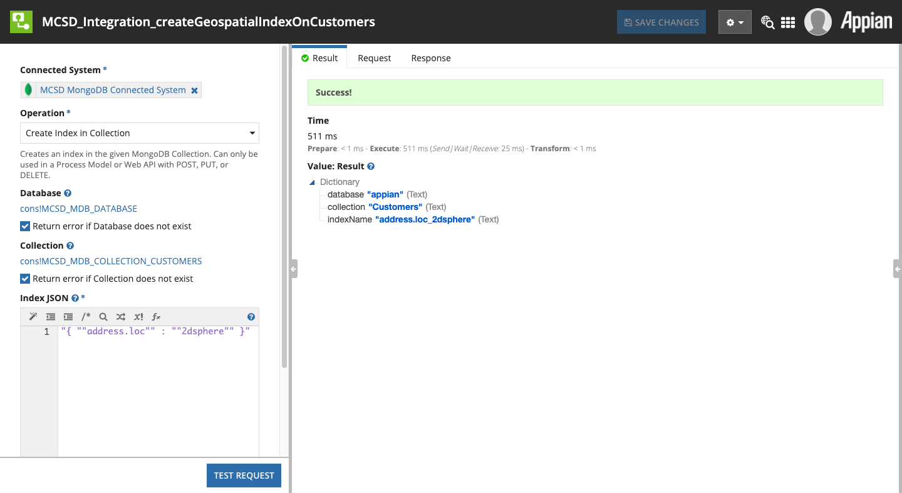

Parameters
----------

*Database*
^^^^^^^^^^

Refer to :ref:`Common Database` in Common Configuration Parameters.

*Collection*
^^^^^^^^^^^^

Refer to :ref:`Common Collection` in Common Configuration Parameters.

*Index JSON*
^^^^^^^^^^^^

The `MongoDB Index Document <https://docs.mongodb.com/manual/indexes/>`_ in JSON form to instruct MongoDB how to create the new index.

Result Value
------------

+------------------+-----------------+---------------------------------------+
| **Field Name**   | **Data Type**   | **Description**                       |
+------------------+-----------------+---------------------------------------+
| ``database``     | *Text*          | The database used                     |
+------------------+-----------------+---------------------------------------+
| ``collection``   | *Text*          | The collection used                   |
+------------------+-----------------+---------------------------------------+
| ``indexName``    | *Text*          | The name of the newly created Index   |
+------------------+-----------------+---------------------------------------+

Insert Many in Collection
=========================

Performs the `Insert Many <https://docs.mongodb.com/manual/reference/method/db.collection.insertMany/>`_ operation, creating new MongoDB Document instances in the Collection provided.

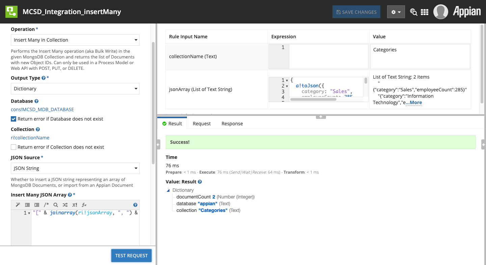

This Integration Operation allows you to select the source of the JSON to be inserted, either as a List of Text (an array of JSON documents) or by reading JSON from an Appian Document.

When used in conjunction with one of the other WRITE operations that produce Appian Document outputs (such as :ref:`Collection Find to JSON File`) this allows for the export and import of larger amounts of data without impacting Process Engine memory usage.

Parameters
----------

*Output Type*
^^^^^^^^^^^^^

Refer to :ref:`Common Output Type` in Common Configuration Parameters.

*Database*
^^^^^^^^^^

Refer to :ref:`Common Database` in Common Configuration Parameters.

*Collection*
^^^^^^^^^^^^

Refer to :ref:`Common Collection` in Common Configuration Parameters.

*JSON Source*
^^^^^^^^^^^^^

This parameter allows you to select between passing in JSON values or alternatively reading JSON from an Appian Document.

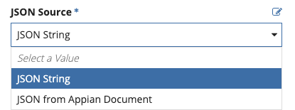

*Insert Many JSON Array*
^^^^^^^^^^^^^^^^^^^^^^^^

.. note:: Present only if `JSON Source`_ is "JSON String."

The JSON array of MongoDB Documents to be inserted, in the form of: ``[ { ... }, { ... } ]``

*Source JSON File*
^^^^^^^^^^^^^^^^^^

.. note:: Present only if `JSON Source`_ is "JSON from Appian Document."

The Appian Document that contains the MongoDB Documents in JSON form to be inserted.

*JSON File Contains a Single Array*
^^^^^^^^^^^^^^^^^^^^^^^^^^^^^^^^^^^

.. note:: Present only if `JSON Source`_ is "JSON from Appian Document."

If **Yes** (or ``true``) then the file will be treated as a single JSON array of MongoDB Documents, e.g. ``[ { ... }, { ... } ]``

If **No** (or ``false``) then the file must have one JSON object per line (delimited with newline), without trailing commas.

*Skip Automatic Date Time Conversion*
^^^^^^^^^^^^^^^^^^^^^^^^^^^^^^^^^^^^^

.. note:: Present only if `JSON Source`_ is "JSON from Appian Document."

Refer to :ref:`Common Skip Automatic Date Time Conversion` in Common Configuration Parameters.

Result Value
------------

+------------------+--------------------+-------------------------------------------------------------------+
| **Field Name**   | **Data Type**      | **Description**                                                   |
+------------------+--------------------+-------------------------------------------------------------------+
| ``database``     | *Text*             | The database used                                                 |
+------------------+--------------------+-------------------------------------------------------------------+
| ``collection``   | *Text*             | The collection used                                               |
+------------------+--------------------+-------------------------------------------------------------------+
| ``documentCount``| *Number (Integer)* | The count of new MongoDB Documents inserted into the Collection   |
+------------------+--------------------+-------------------------------------------------------------------+

Insert One in Collection
========================

Performs the `Insert One <https://docs.mongodb.com/manual/reference/method/db.collection.insertOne/>`_ operation, creating a new, singular MongoDB Document instance in the Collection provided.

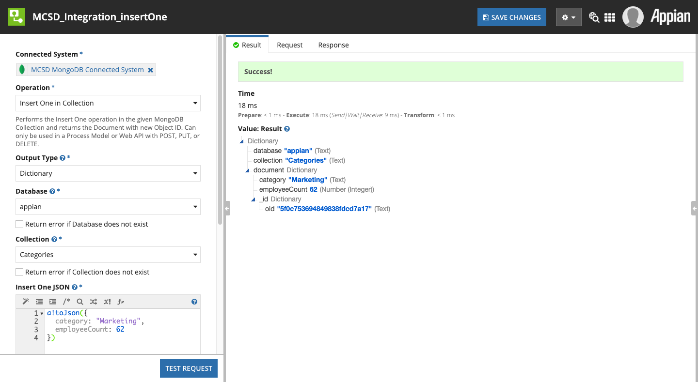

Parameters
----------

*Output Type*
^^^^^^^^^^^^^

Refer to :ref:`Common Output Type` in Common Configuration Parameters.

*Database*
^^^^^^^^^^

Refer to :ref:`Common Database` in Common Configuration Parameters.

*Collection*
^^^^^^^^^^^^

Refer to :ref:`Common Collection` in Common Configuration Parameters.

*Insert One JSON*
^^^^^^^^^^^^^^^^^

The JSON value of the MongoDB Document to be inserted

Result Value
------------

+------------------+----------------------------+------------------------------------------------------------------------------------------------------------------------------------------+
| **Field Name**   | **Data Type**              | **Description**                                                                                                                          |
+------------------+----------------------------+------------------------------------------------------------------------------------------------------------------------------------------+
| ``database``     | *Text*                     | The database used                                                                                                                        |
+------------------+----------------------------+------------------------------------------------------------------------------------------------------------------------------------------+
| ``collection``   | *Text*                     | The collection used                                                                                                                      |
+------------------+----------------------------+------------------------------------------------------------------------------------------------------------------------------------------+
| ``document``     | *Dictionary* **OR** *Text* | The MongoDB Document produced by the Insert One operation, either as a Dictionary or JSON string depending on the Output Type selected   |
+------------------+----------------------------+------------------------------------------------------------------------------------------------------------------------------------------+

Update Many in Collection
=========================

Performs the `Update Many <https://docs.mongodb.com/manual/reference/method/db.collection.updateMany/>`_ operation, updating all MongoDB Document instances that match the provided Filter JSON.

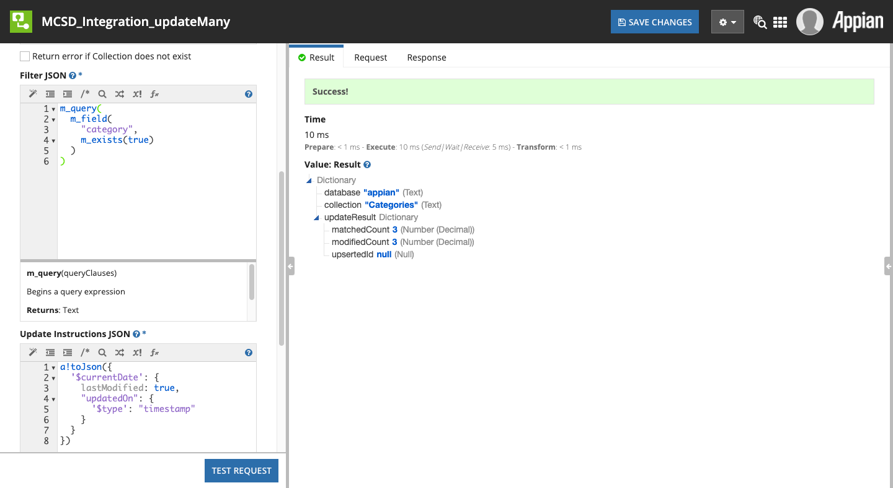

Parameters
----------

*Output Type*
^^^^^^^^^^^^^

Refer to :ref:`Common Output Type` in Common Configuration Parameters.

*Database*
^^^^^^^^^^

Refer to :ref:`Common Database` in Common Configuration Parameters.

*Collection*
^^^^^^^^^^^^

Refer to :ref:`Common Collection` in Common Configuration Parameters.

*Filter JSON*
^^^^^^^^^^^^^

Refer to :ref:`Common Filter JSON` in Common Configuration Parameters.

*Update Instructions JSON*
^^^^^^^^^^^^^^^^^^^^^^^^^^

This field accepts the JSON to instruct MongoDB how to update the MongoDB Documents matched by the Filter JSON, using `Update Operators <https://docs.mongodb.com/manual/reference/operator/update/>`_.

*Skip Automatic Date Time Conversion*
^^^^^^^^^^^^^^^^^^^^^^^^^^^^^^^^^^^^^

Refer to :ref:`Common Skip Automatic Date Time Conversion` in Common Configuration Parameters.

Result Value
------------

+------------------+----------------------------+------------------------------------------------------------------------------------------------------------------------------------------------------------------------------------------------------------------------------------------------+
| **Field Name**   | **Data Type**              | **Description**                                                                                                                                                                                                                                |
+------------------+----------------------------+------------------------------------------------------------------------------------------------------------------------------------------------------------------------------------------------------------------------------------------------+
| ``database``     | *Text*                     | The database used                                                                                                                                                                                                                              |
+------------------+----------------------------+------------------------------------------------------------------------------------------------------------------------------------------------------------------------------------------------------------------------------------------------+
| ``collection``   | *Text*                     | The collection used                                                                                                                                                                                                                            |
+------------------+----------------------------+------------------------------------------------------------------------------------------------------------------------------------------------------------------------------------------------------------------------------------------------+
| ``updateResult`` | *Dictionary* **OR** *Text* | A Dictionary or JSON string (depending on the Output Type selected) that represents the `Update Many results <https://docs.mongodb.com/manual/reference/method/db.collection.updateMany/#returns>`_ as defined in the MongoDB Documentation    |
+------------------+----------------------------+------------------------------------------------------------------------------------------------------------------------------------------------------------------------------------------------------------------------------------------------+

Update One in Collection
========================

Performs the `Update One <https://docs.mongodb.com/manual/reference/method/db.collection.updateOne/>`_ operation, updating a singular MongoDB Document instance that match the provided Filter JSON.

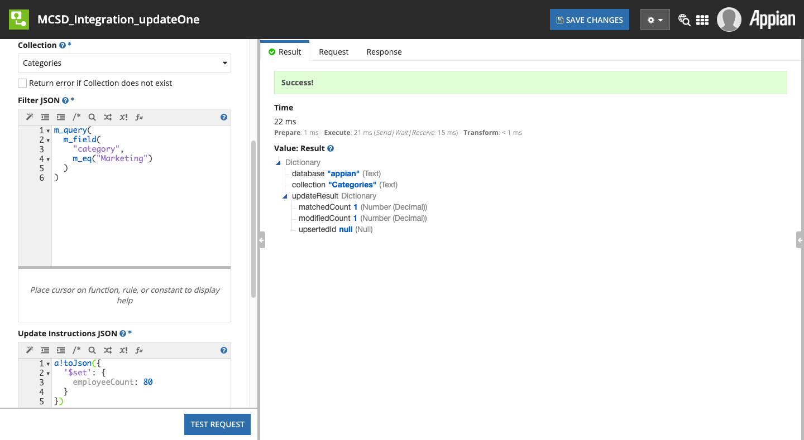

Parameters
----------

*Output Type*
^^^^^^^^^^^^^

Refer to :ref:`Common Output Type` in Common Configuration Parameters.

*Database*
^^^^^^^^^^

Refer to :ref:`Common Database` in Common Configuration Parameters.

*Collection*
^^^^^^^^^^^^

Refer to :ref:`Common Collection` in Common Configuration Parameters.

*Filter JSON*
^^^^^^^^^^^^^

Refer to :ref:`Common Filter JSON` in Common Configuration Parameters.

.. note:: This should match a *single* MongoDB Document, e.g. by filtering on the MongoDB Document's ID (ObjectID).

*Update Instructions JSON*
^^^^^^^^^^^^^^^^^^^^^^^^^^

This field accepts the JSON to instruct MongoDB how to update the MongoDB Documents matched by the Filter JSON, using `Update Operators <https://docs.mongodb.com/manual/reference/operator/update/>`_.

*Skip Automatic Date Time Conversion*
^^^^^^^^^^^^^^^^^^^^^^^^^^^^^^^^^^^^^

Refer to :ref:`Common Skip Automatic Date Time Conversion` in Common Configuration Parameters.

Result Value
------------

+------------------+----------------------------+----------------------------------------------------------------------------------------------------------------------------------------------------------------------------------------------------------------------------------------------+
| **Field Name**   | **Data Type**              | **Description**                                                                                                                                                                                                                              |
+------------------+----------------------------+----------------------------------------------------------------------------------------------------------------------------------------------------------------------------------------------------------------------------------------------+
| ``database``     | *Text*                     | The database used                                                                                                                                                                                                                            |
+------------------+----------------------------+----------------------------------------------------------------------------------------------------------------------------------------------------------------------------------------------------------------------------------------------+
| ``collection``   | *Text*                     | The collection used                                                                                                                                                                                                                          |
+------------------+----------------------------+----------------------------------------------------------------------------------------------------------------------------------------------------------------------------------------------------------------------------------------------+
| ``updateResult`` | *Dictionary* **OR** *Text* | A Dictionary or JSON string (depending on the Output Type selected) that represents the `Update One results <https://docs.mongodb.com/manual/reference/method/db.collection.updateOne/#returns>`_ as defined in the MongoDB Documentation    |
+------------------+----------------------------+----------------------------------------------------------------------------------------------------------------------------------------------------------------------------------------------------------------------------------------------+

Replace One in Collection
=========================

Performs the `Replace One <https://docs.mongodb.com/manual/reference/method/db.collection.replaceOne/>`_ operation, completely a singular MongoDB Document instance that match the provided Filter JSON with an entire new MongoDB Document.

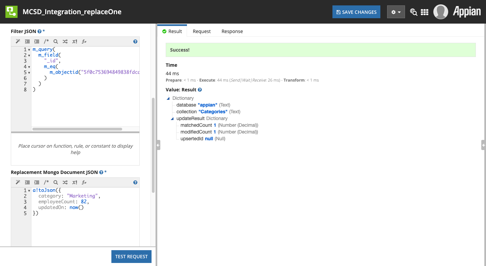

Parameters
----------

*Output Type*
^^^^^^^^^^^^^

Refer to :ref:`Common Output Type` in Common Configuration Parameters.

*Database*
^^^^^^^^^^

Refer to :ref:`Common Database` in Common Configuration Parameters.

*Collection*
^^^^^^^^^^^^

Refer to :ref:`Common Collection` in Common Configuration Parameters.

*Filter JSON*
^^^^^^^^^^^^^

Refer to :ref:`Common Filter JSON` in Common Configuration Parameters.

.. note:: This should match a *single* MongoDB Document, e.g. by filtering on the MongoDB Document's ID (ObjectID).

*Replacement Mongo Document JSON*
^^^^^^^^^^^^^^^^^^^^^^^^^^^^^^^^^

The JSON value of the new MongoDB Document to replace the one matched.

*Skip Automatic Date Time Conversion*
^^^^^^^^^^^^^^^^^^^^^^^^^^^^^^^^^^^^^

Refer to :ref:`Common Skip Automatic Date Time Conversion` in Common Configuration Parameters.

Result Value
------------

+------------------+----------------------------+----------------------------------------------------------------------------------------------------------------------------------------------------------------------------------------------------------------------------------------------+
| **Field Name**   | **Data Type**              | **Description**                                                                                                                                                                                                                              |
+------------------+----------------------------+----------------------------------------------------------------------------------------------------------------------------------------------------------------------------------------------------------------------------------------------+
| ``database``     | *Text*                     | The database used                                                                                                                                                                                                                            |
+------------------+----------------------------+----------------------------------------------------------------------------------------------------------------------------------------------------------------------------------------------------------------------------------------------+
| ``collection``   | *Text*                     | The collection used                                                                                                                                                                                                                          |
+------------------+----------------------------+----------------------------------------------------------------------------------------------------------------------------------------------------------------------------------------------------------------------------------------------+
| ``updateResult`` | *Dictionary* **OR** *Text* | A Dictionary or JSON string (depending on the Output Type selected) that represents the `Update One results <https://docs.mongodb.com/manual/reference/method/db.collection.updateOne/#returns>`_ as defined in the MongoDB Documentation    |
+------------------+----------------------------+----------------------------------------------------------------------------------------------------------------------------------------------------------------------------------------------------------------------------------------------+

Delete Many in Collection
=========================

Performs the `Delete Many <https://docs.mongodb.com/manual/reference/method/db.collection.deleteMany/>`_ operation, deleting all MongoDB Document instances that match the provided Filter JSON.

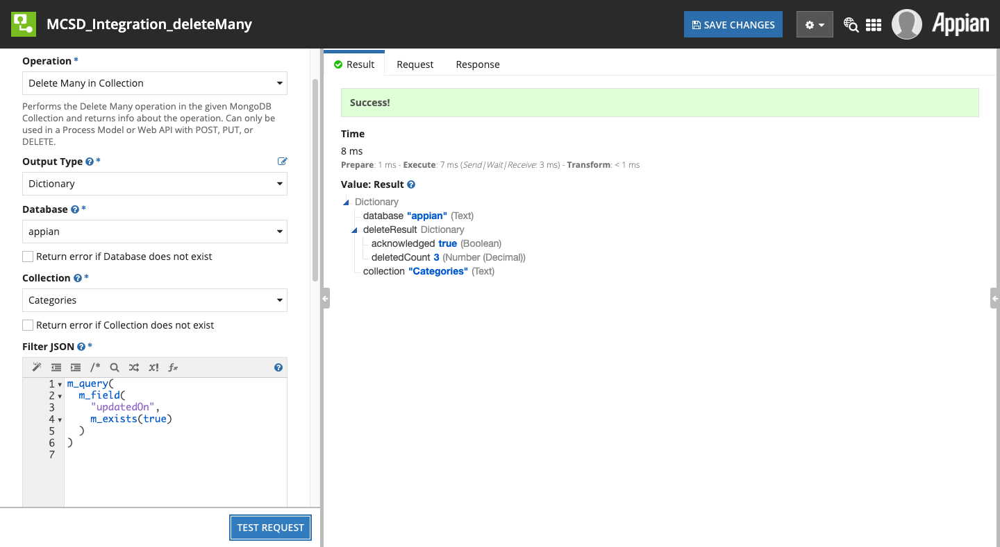

Parameters
----------

*Output Type*
^^^^^^^^^^^^^

Refer to :ref:`Common Output Type` in Common Configuration Parameters.

*Database*
^^^^^^^^^^

Refer to :ref:`Common Database` in Common Configuration Parameters.

*Collection*
^^^^^^^^^^^^

Refer to :ref:`Common Collection` in Common Configuration Parameters.

*Filter JSON*
^^^^^^^^^^^^^

Refer to :ref:`Common Filter JSON` in Common Configuration Parameters.

.. warning:: It is very important that your Filter JSON matches only the subset of MongoDB Documents to be deleted. There is no "undo" functionality of this operation.

*Collation*
^^^^^^^^^^^

Refer to :ref:`Common Collation` in Common Configuration Parameters.

Result Value
------------

+------------------+--------------------+------------------------------------------------------------------------------+
| **Field Name**   | **Data Type**      | **Description**                                                              |
+------------------+--------------------+------------------------------------------------------------------------------+
| ``database``     | *Text*             | The database used                                                            |
+------------------+--------------------+------------------------------------------------------------------------------+
| ``collection``   | *Text*             | The collection used                                                          |
+------------------+--------------------+------------------------------------------------------------------------------+
| ``deleteResult`` | *Dictionary*       | Contains the results of the operation with the following 2 keys and values   |
+------------------+--------------------+------------------------------------------------------------------------------+
| ``.acknowledged``| *Boolean*          | That the Delete One operation was acknowledged by MongoDB                    |
+------------------+--------------------+------------------------------------------------------------------------------+
| ``.deletedCount``| *Number (Integer)* | The number of MongoDB Documents deleted by this operation.                   |
+------------------+--------------------+------------------------------------------------------------------------------+

Delete One in Collection
========================

Performs the `Delete One <https://docs.mongodb.com/manual/reference/method/db.collection.deleteOne/>`_ operation, updating a singular MongoDB Document instance that match the provided Filter JSON.

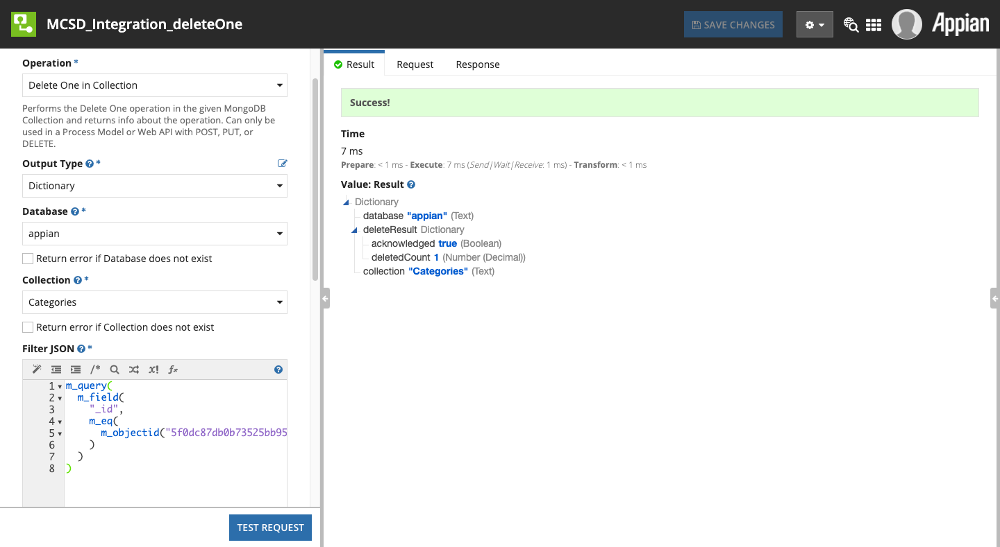

Parameters
----------

*Output Type*
^^^^^^^^^^^^^

Refer to :ref:`Common Output Type` in Common Configuration Parameters.

*Database*
^^^^^^^^^^

Refer to :ref:`Common Database` in Common Configuration Parameters.

*Collection*
^^^^^^^^^^^^

Refer to :ref:`Common Collection` in Common Configuration
Parameters.

*Filter JSON*
^^^^^^^^^^^^^

Refer to :ref:`Common Filter JSON` in Common Configuration Parameters.

.. warning:: It is very important that your Filter JSON matches only the **single** MongoDB Document to be deleted. There is no "undo" functionality of this operation.

*Collation*
^^^^^^^^^^^

Refer to :ref:`Common Collation` in Common Configuration Parameters.

Result Value
------------

+------------------+--------------------+--------------------------------------------------------------------------------------------------+
| **Field Name**   | **Data Type**      | **Description**                                                                                  |
+------------------+--------------------+--------------------------------------------------------------------------------------------------+
| ``database``     | *Text*             | The database used                                                                                |
+------------------+--------------------+--------------------------------------------------------------------------------------------------+
| ``collection``   | *Text*             | The collection used                                                                              |
+------------------+--------------------+--------------------------------------------------------------------------------------------------+
| ``deleteResult`` | *Dictionary*       | Contains the results of the operation with the following 2 keys and values                       |
+------------------+--------------------+--------------------------------------------------------------------------------------------------+
| ``.acknowledged``| *Boolean*          | That the Delete One operation was acknowledged by MongoDB                                        |
+------------------+--------------------+--------------------------------------------------------------------------------------------------+
| ``.deletedCount``| *Number (Integer)* | The number of MongoDB Documents deleted by this operation (should always be 1 for Delete One).   |
+------------------+--------------------+--------------------------------------------------------------------------------------------------+

Drop Collection
===============

Performs the `Drop <https://docs.mongodb.com/manual/reference/method/db.collection.drop/>`_ operation on a Collection, deleting the Collection and any MongoDB Documents found within.

.. warning:: This operation can be very destructive if not used with great caution. There is no "undo" functionality of this operation.

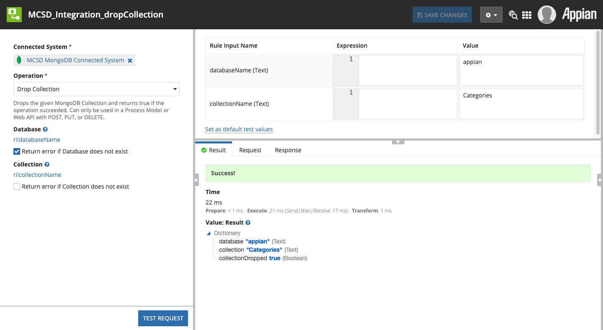

Parameters
----------

*Database*
^^^^^^^^^^

Refer to :ref:`Common Database` in Common Configuration Parameters.

*Collection*
^^^^^^^^^^^^

Refer to :ref:`Common Collection` in Common Configuration Parameters.

Result Value
------------

+-----------------------+-----------------+---------------------------------------------------+
| **Field Name**        | **Data Type**   | **Description**                                   |
+-----------------------+-----------------+---------------------------------------------------+
| ``database``          | *Text*          | The database used                                 |
+-----------------------+-----------------+---------------------------------------------------+
| ``collection``        | *Text*          | The collection used                               |
+-----------------------+-----------------+---------------------------------------------------+
| ``collectionDropped`` | *Boolean*       | Whether the Collection was successfully dropped   |
+-----------------------+-----------------+---------------------------------------------------+

Common Configuration Parameters
-------------------------------

This section describes the collection of Parameters that are shared among multiple Integration Operations.

.. _Common Output Type:

Output Type
===========

This parameter allows you to select how the Integration Operation returns the data, either as Appian Dictionaries or as a List of Text containing the JSON representations of the MongoDB Documents. See :ref:`Special Considerations` for how ObjectIds are transformed when being output as Dictionaries.

When selecting the List of JSON Strings, the JSON output comes directly from the MongoDB Java Driver, which represents the data in its "purest" form.

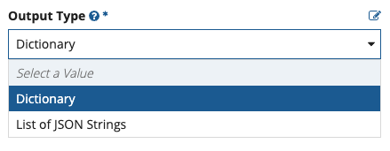

.. _Common Database:

Database
========

This parameter tells the Integration Operation which MongoDB Database to perform the operation on. The drop-down is automatically populated with the available Databases in your Connected System, using the same method as :ref:`List Databases <READ List Databases>` above.

Below the drop-down is a checkbox which if checked will ensure that the Database exists before performing the Operation. MongoDB is very forgiving and will allow many API methods to be performed on non-existent Databases, returning null or an empty set. Checking this box will ensure that the database exists, to help avoid entering the wrong database name.

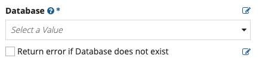

.. _Common Collection:

Collection
==========

This parameter tells the Integration Operation which MongoDB Collection to perform the operation on. The drop-down is automatically populated with the available Collections in the given Database in your Connected System, using the same method as :ref:`List Collections <READ List Collections>` above.

Below the drop-down is a checkbox which if checked will ensure that the Collection exists before performing the Operation. MongoDB is very forgiving and will allow many API methods to be performed on non-existent Collections, returning null or an empty set. Checking this box will ensure that the Collection exists, to help avoid entering the wrong Collection name.

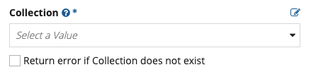

.. note:: For WRITE operations (e.g. `Insert One in Collection`_), if the checkbox is unchecked and the Collection does not exist, MongoDB will *create a new Collection* with the given name to perform the write into. This can be an unintended action, but it can also be very useful when performing certain business functions, such as reading back the results of a `Collection Aggregate`_ and writing them to a new Collection in one nested operation.

.. _Common Filter JSON:

Filter JSON
===========

This parameter represents a `MongoDB Query Document <https://docs.mongodb.com/manual/tutorial/query-documents/>`_ in JSON form. This is the query language that MongoDB uses, similar to how RDBMS platforms use SQL. When present, the value provided here will be used to match MongoDB Documents in the given Collection.

For READ operations such as Find, this will determine which MongoDB Documents are returned.

For WRITE operations such as Update, this will determine which MongoDB Documents are modified, so it is critical your Filter JSON matches only those to be modified. It is therefore a good idea to test your Filter JSON values for WRITE operations before performing them (e.g. by performing a Find first and validating that only the documents to be updated are returned).

This JSON string value can be hard-coded, constructed via Expressions or Expression Rules, or constructed using the :ref:`JSON Query Expression Functions` as shown:

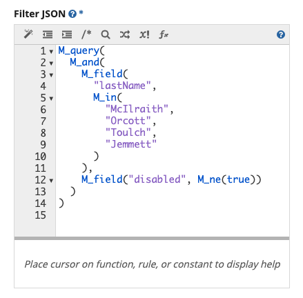

.. _Common Output JSON As a Single Array:

Output JSON As a Single Array
=============================

This will join the results as a JSON array such as: ``[ { ... }, { ... } ]``, allowing easier import using `Insert Many in Collection`_ or other MongoDB tools. Selecting No (or false) will write one MongoDB Document per line.

.. _Common Save to Folder:

Save to Folder
==============

The Appian Folder where the new Document will be created. This is a standard Appian folder picker.

.. _Common Filename:

Filename
========

The complete name of the output file, including any extension you would like (most commonly .json)

.. _Common Skip Automatic Date Time Conversion:

Skip Automatic Date Time Conversion
===================================

This plugin will attempt to detect Dates and Times and convert them to MongoDB timestamps. Selecting Yes (or true) here will skip this and instead insert these values as Strings.

.. _Common Character Set:

Character Set
=============

The character set that the text file should use. Valid values are:

+----------------+------------------------------------------------------------------------------------------------+
| **Value**      | **Description**                                                                                |
+----------------+------------------------------------------------------------------------------------------------+
| ``ISO-8859-1`` | ISO Latin Alphabet No. 1, a.k.a. ISO-LATIN-1                                                   |
+----------------+------------------------------------------------------------------------------------------------+
| ``UTF-8``      | Eight-bit UCS Transformation Format                                                            |
+----------------+------------------------------------------------------------------------------------------------+
| ``UTF-16LE``   | Sixteen-bit UCS Transformation Format, little-endian byte order                                |
+----------------+------------------------------------------------------------------------------------------------+
| ``UTF-16``     | Sixteen-bit UCS Transformation Format, byte order identified by an optional byte-order mark    |
+----------------+------------------------------------------------------------------------------------------------+
| ``UTF-16BE``   | Sixteen-bit UCS Transformation Format, big-endian byte order                                   |
+----------------+------------------------------------------------------------------------------------------------+
| ``US-ASCII``   | Seven-bit ASCII, a.k.a. ISO646-US, a.k.a. the Basic Latin block of the Unicode character set   |
+----------------+------------------------------------------------------------------------------------------------+

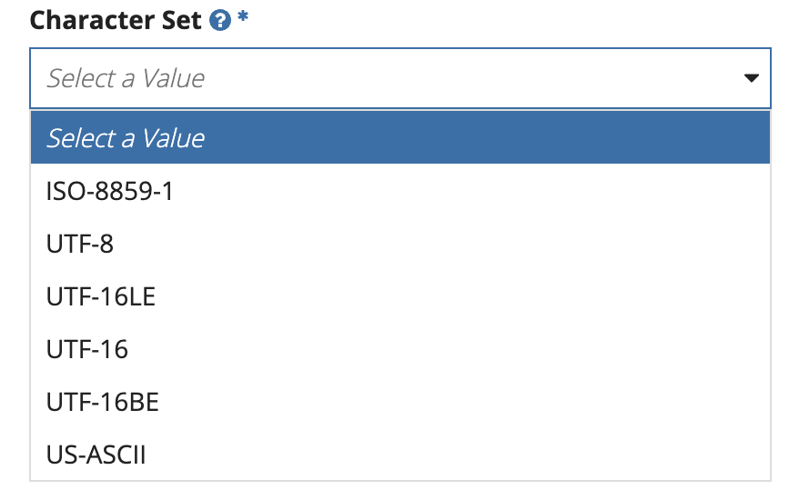

.. _Common Collation:

Collation
=========

`Collation <https://docs.mongodb.com/manual/reference/collation/>`_ allows users to specify language-specific rules for string comparison, such as rules for letter case and accent marks. This parameter section allows you to individually configure a `Collation Document <https://docs.mongodb.com/manual/reference/collation/#collation-document>`_, or you can define one by building an Appian Dictionary (and not a JSON string) in the form of:

.. code-block:: JSON
  {
    COLLATION_LOCALE: "text",
    COLLATION_CASE_LEVEL: true,
    COLLATION_CASE_FIRST: "text",
    COLLATION_STRENGTH: 100,
    COLLATION_NUMERIC_ORDERING: true,
    COLLATION_ALTERNATE: "text",
    COLLATION_MAX_VARIABLE: "text",
    COLLATION_BACKWARDS: true
  }

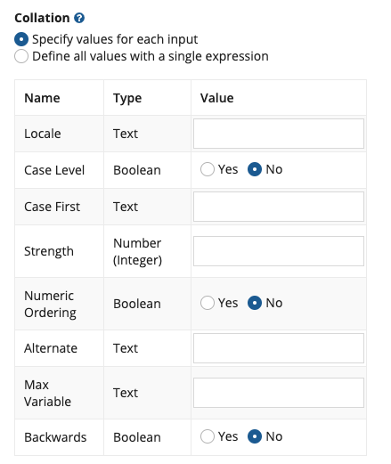

.. _Common Read Preference:

Read Preference
===============

`Read Preference <https://docs.mongodb.com/manual/core/read-preference/>`_ describes how MongoDB clients route read operations to the members of a replica set.

.. _Common Read Concern:

Read Concern
============

`Read Concern <https://docs.mongodb.com/manual/reference/read-concern/>`_ allows you to control the consistency and isolation properties of the data read from replica sets and replica set shards.
